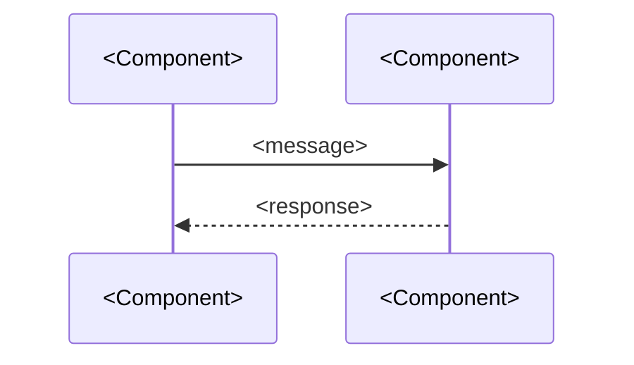
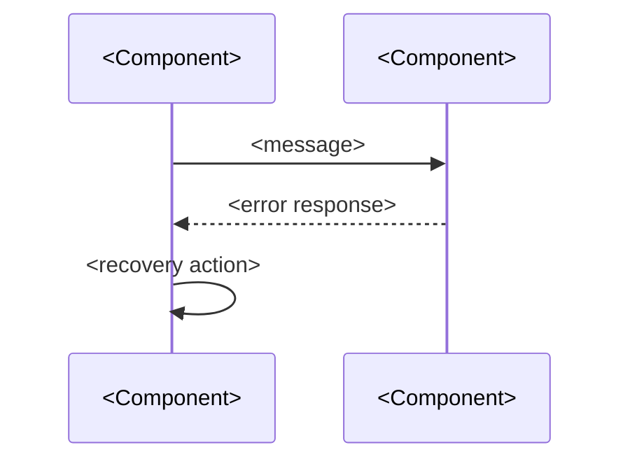
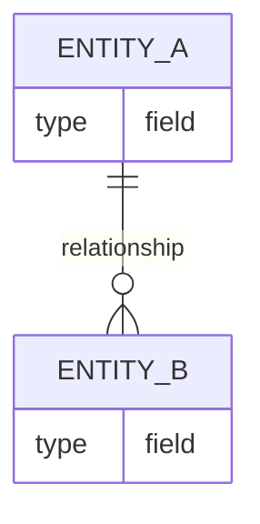

# DESIGN — <Project Name>

## Solution Strategy
[If applicable — include when architecture involves non-obvious choices]
<!-- Extended: required — covers technology choices, decomposition rationale, quality goal mapping -->
<Summary of fundamental decisions and approaches that shaped this architecture.
Why is it structured the way it is? What technology choices were made and why?
How does the architecture address the top quality goals?>

---

## Runtime Architecture
<How the system operates at runtime. Components, responsibilities, communication.>


---

## Building Block View

### Level 1 — System Overview
<Top-level decomposition. Major subsystems or components and their responsibilities.>

| Component | Responsibility |
|-----------|---------------|
| <Component> | <What it does> |
[If applicable] | <Component> | <What it does> |

### Level 2 — Component Detail
[If applicable — include for components complex enough to warrant it]
<Internal structure of level-1 components where detail matters.>

### Level 3+
<!-- Extended only — use sparingly, only when Level 2 is insufficient -->
[If applicable]
<Use sparingly. Prefer relevance over completeness.>

---

## Runtime View
[If applicable — include when error or exception flows are non-obvious]
<!-- Extended: required; use named scenario headings -->

<!-- Standard version: prose + optional diagram -->
<Key runtime scenarios showing how components interact under normal and error conditions.>

[If applicable]


<!-- Extended version (replace above with named scenarios):
### Scenario: <Normal Flow Name>


### Scenario: <Error or Exception Flow>
[If applicable]

-->

---

## Deployment View
[If applicable — include when deployment is non-trivial or involves multiple environments]
<!-- Extended: required -->
<How the system is deployed. Infrastructure, environments, and component mapping.>

[If applicable]
```mermaid
graph TD
    subgraph <Environment>
        A[<Component>]
        B[<Component>]
    end
    A --> B
```

<!-- Extended: add environment matrix when multiple environments exist
| Environment | Purpose | Components Deployed |
|-------------|---------|-------------------|
| <e.g. Production> | <Live system> | <Components> |
| <e.g. Staging> | <Pre-release testing> | <Components> |
-->

---

## Crosscutting Concepts
[If applicable — include when patterns or rules apply across multiple components]
<!-- Extended: required -->

### <Concept e.g. Error Handling>
<How this concern is addressed consistently across the system.>

[If applicable]
### <Concept e.g. Logging>
<Approach and standards.>

<!-- Extended: add Security, Audit as applicable
### <Concept e.g. Security>
<Authentication, authorization, data protection approach.>
-->

---

## Data Model
[If applicable]
<Key data structures and their relationships.>

[If applicable]


---

## Dependency Rules
[If applicable]
- <e.g. Modules may not import from sibling modules — only from shared/>
- <e.g. External I/O is isolated to the adapters layer>

---

## Test Model
<!-- Required when testing methodology is declared (Standard+). Produced jointly by Architect and Quality
     in the planning phase. Implementation cannot begin without this section. -->
[If testing methodology is declared — required at Standard/Extended tier]

### E2E Framework

| Item | Value |
|---|---|
| Framework | `<e.g. pytest + pytest-asyncio / jest / vitest>` |
| Run command | `<e.g. uv run pytest / npm test>` |
| Declared methodology | `<atdd-bdd>` — `$DEVSTANDARD/knowledge-base/methodology/testing/atdd-bdd.md` |

> **⚙ PROJECT OVERLAY:** Replace framework and command with project specifics.

### Fixture Scope Architecture

<!-- Define what state is established at each scope level. Tests declare which scope they require;
     they do not build state themselves. -->

| Scope | Established once per | What it provides |
|---|---|---|
| **Session** | Test run | `<e.g. Application process, authenticated admin session>` |
| **Suite** | Test file / feature group | `<e.g. Known dataset loaded, feature-specific auth state>` |
| **Workflow** | Test workflow sequence | `<e.g. Document open and in edit mode>` |
| **Function** | Individual test | `<e.g. Transient overrides, test-local state>` |

> **⚙ PROJECT OVERLAY:** Define the actual fixture scopes for this project. Map each to the setup
> cost it amortises — expensive setup (auth, app launch, data load) belongs at Session or Suite scope.

### Workflow Sequences

<!-- One sequence per primary use case flow from CONTEXT.md. Each step is a test that inherits
     state from the prior step. Sequences are the primary acceptance verification pattern. -->

#### `<Use Case ID>` — `<Use Case Name>`

| Step | Given (precondition state) | When (action) | Then (expected outcome) |
|---|---|---|---|
| 1 | `<e.g. Authenticated user, document list loaded>` | `<e.g. User opens document by name>` | `<e.g. Document displayed, title in header>` |
| 2 | `<State inherited from step 1>` | `<e.g. User edits document title>` | `<e.g. Title updates in header immediately>` |

> **⚙ PROJECT OVERLAY:** Add one table per primary use case flow. Scenarios are derived from
> CONTEXT.md use cases and ACs. Security's threat model boundary crossings become mandatory steps.

### Atomic Tests

<!-- Atomic tests verify a single behaviour in isolation. List the categories that warrant
     atomic coverage for this project. -->

| Category | Example | Rationale |
|---|---|---|
| `<e.g. Parsing>` | `<e.g. Malformed input returns specific error>` | `<e.g. Boundary conditions not easily reached in workflow>` |
| `<e.g. Calculation>` | `<e.g. Fee calculation edge cases>` | `<e.g. Many cases, expensive to set up as workflow>` |

### Anti-Patterns

<!-- Preserve these — they represent design decisions made in this test model. -->

- **Cold-start per test**: Do not re-authenticate, re-launch, or reload datasets for each test. Establish expensive state at the appropriate fixture scope.
- **Implementation-coupled tests**: Tests must express what the system does, not how. Name behaviours, not methods.
- **Spec-free implementation**: No implementation increment begins without a Quality-authored test specification for that increment. Tests written after code are not ATDD.
- **Untested boundary crossings**: Every trust boundary crossing in Security's threat model must have a corresponding E2E scenario. No exceptions.

> **⚙ PROJECT OVERLAY:** Add project-specific anti-patterns discovered during development.

---

## References
[If applicable]
| Document | Location | Covers |
|----------|----------|--------|
| <Document name> | <assets/ path or URL> | <What it covers> |
