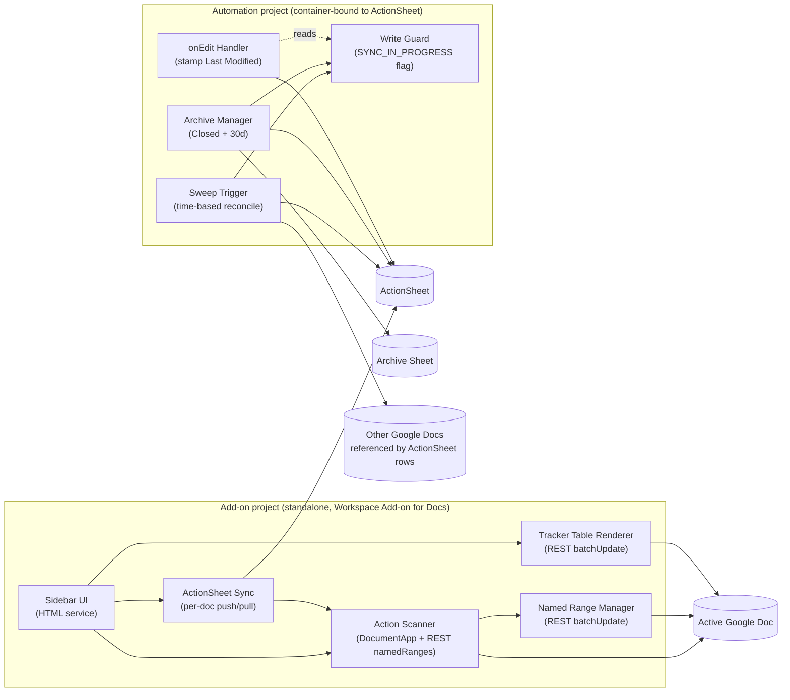
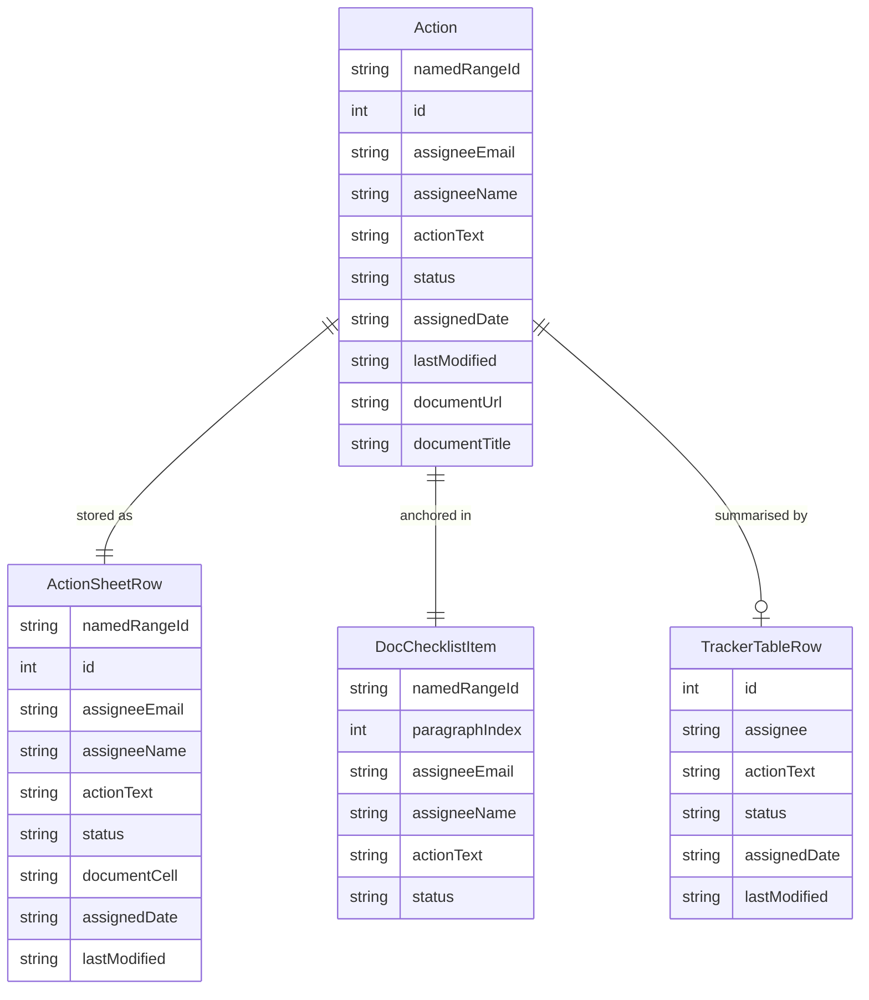

# DESIGN — GActionSheet

## Solution Strategy
GActionSheet is split into two independently deployed Apps Script projects that share no code and never call each other; their only contract is the row schema of the **ActionSheet** spreadsheet.

- The **Add-on project** is a standalone Apps Script with a Google Workspace Add-on manifest for Docs. It provides the sidebar UI shown in the active document, scans the doc for chip-led checklist items, anchors each action with a named range (via the Docs REST API `batchUpdate`), and reconciles the doc's actions with rows in the ActionSheet on demand.
- The **Automation project** is a container-bound Apps Script on the ActionSheet. It owns the installable `onEdit` trigger (stamping `Last Modified` on user edits), the time-based sweep trigger (reconciles docs no one opened recently), and the archive job (Closed + 30d → archive sheet).

Stable action identity comes from a named range whose `namedRangeId` is recorded on the ActionSheet row. DocumentApp is used for read-side traversal because it exposes PERSON chips ergonomically; the Docs REST API is used for write-side anchoring and tracker-table mutation because it supports named ranges and atomic batch updates.

---

## Runtime Architecture

The two subgraphs share no arrow; communication is solely through `ActionSheet` rows.

---

## Building Block View

### Add-on project

| Component | Responsibility |
|-----------|---------------|
| Sidebar UI | Renders the action list for the active doc; surfaces **Sync now**, **Insert / refresh tracker**, warning rows, and orphan-anchor prompts |
| Action Scanner | Reads the active doc via DocumentApp: walks paragraphs, identifies checklist items whose first inline child is a PERSON chip, extracts the chip's name/email, the action text, and the trailing `(Status)` token; reads existing named ranges via the REST API to resolve identity |
| Named Range Manager | Creates a named range over a newly seen action paragraph; deletes a range when its action is no longer present; re-anchors when an existing row's range is missing but its action+assignee still match a paragraph |
| Tracker Table Renderer | Inserts or refreshes the in-doc tracker table at its own named-range anchor, preceded by the instructional paragraph summarizing the sync rules; uses REST `batchUpdate` for atomic in-place replacement |
| ActionSheet Sync | Reads ActionSheet rows for the active doc, compares with scanner output by `namedRangeId`, applies `Last Modified` precedence, writes diffs to either side; sets the automation project's `SYNC_IN_PROGRESS` script property on the ActionSheet before sheet writes |

### Automation project

| Component | Responsibility |
|-----------|---------------|
| onEdit Handler | Installable trigger on the ActionSheet; stamps `Last Modified` on the edited row unless `SYNC_IN_PROGRESS` is set |
| Sweep Trigger | Time-based; groups ActionSheet rows by document URL, opens each doc, performs the same reconcile the sidebar's **Sync now** would have done; bounded by GAS execution-time budget; subsequent runs resume where the previous left off |
| Archive Manager | Identifies ActionSheet rows with `Status = Closed` and `Last Modified > 30 days`; moves them to the archive sheet without altering timestamps |
| Write Guard | Manages the `SYNC_IN_PROGRESS` flag (a script property on the ActionSheet's container script); set before any programmatic sheet write, cleared in `finally`; read by `onEdit Handler` to skip stamp updates during automated writes |

---

## Data Model

The cross-doc key is `namedRangeId`. The doc-scoped `id` is a human-facing integer recomputed at sync time from document order; it is not a stable identifier.

---

## Dependency Rules
- Add-on Scanner reads docs only; it never touches the ActionSheet directly — the Sync component owns sheet I/O
- Sidebar UI never imports another component's internals; it calls a thin façade in the add-on script that fans out to Scanner / NRM / Tracker / Sync
- Automation Sweep performs the same reconciliation as Sidebar Sync but uses its own script identity; the two share no code (the schema is the contract)
- Archive Manager reads from and writes to the ActionSheet only; it does not open documents
- No cross-project calls between add-on and automation

---

## Crosscutting Concepts

### Authoritative surfaces
An action exists on **three** surfaces, but only **two** are authoritative:

| Surface | Role | Edits propagate? |
|---|---|---|
| Floating action paragraph (chip + text + trailing `(Status)`) in the doc | Doc-side authority | Yes — propagated to ActionSheet on Sync |
| ActionSheet row | Cross-doc authority | Yes — propagated to floating action on Sync |
| In-doc tracker table row | Rendered view of the doc's actions | **No** — overwritten on next **Insert / refresh tracker** |

Conflict resolution applies only between the two authoritative surfaces using `Last Modified`. The renderer does not read tracker-table cell contents to decide anything; it always re-renders from the floating actions and ActionSheet row pair.

### Identity
`namedRangeId` is the durable identity. The ActionSheet stores it on every row. During scan, the add-on resolves each chip-led checklist paragraph to a `namedRangeId` by intersecting paragraph indices with the doc's existing named ranges. A paragraph with no covering named range becomes a new action; a named range whose covered paragraph is no longer chip-led becomes a candidate orphan and is offered for re-anchoring (if a paragraph with matching action text and assignee still exists) or surfaced in the sidebar for human resolution.

### Checked state is unreadable
DocumentApp returns `null` for `isChecked()` on every task / checklist item, and the REST API exposes no equivalent field. The visual checkbox is **decorative only**. The truthful status is the trailing `(Status)` parenthesized token on the action paragraph. Components must never branch on visual checked state.

### Status token grammar
A trailing parenthesized token at the end of the action paragraph. `Open` is the default written when missing. `Closed` is recognized for archiving. Any other value (e.g. `(In Review)`, `(Blocked)`) is preserved verbatim and round-trips to the ActionSheet `Status` column. Whitespace inside the parens is trimmed on read; the canonical written form has no leading/trailing whitespace.

### Programmatic Write Suppression
Both the add-on's per-doc Sync and the automation's Sweep / Archive set the automation project's `SYNC_IN_PROGRESS` script property on the ActionSheet before any programmatic sheet write, and clear it in a `finally` block. The `onEdit Handler` reads this flag and returns immediately when set, preventing false `Last Modified` updates from automated writes.

### Idempotence
A Sync or Sweep that finds no differences shall make no writes to any doc or sheet. Enforced by comparing normalized values before writing.

---

## Test Model

### Framework

| Item | Value |
|---|---|
| Framework | `pytest` + `python-docx` + `openpyxl` + Playwright (Node.js) |
| Run command | `uv run pytest tests/ -x -v` |
| Trigger mechanism for end-to-end tests | Playwright drives the sidebar in a live Doc (sidebar UI clicks **Sync now** / **Insert / refresh tracker**); for sweep / archive tests, Playwright runs the automation script's functions from the Apps Script editor |
| Declared methodology | `atdd-bdd` (end-to-end first; atomic tests support root-cause isolation) |

### Fixture Scope Architecture

| Scope | Established once per | What it provides |
|---|---|---|
| **Session** | Test run | Authenticated Playwright browser session (`.auth/user.json`); `local.settings.json` loaded (test doc ID, test ActionSheet ID, add-on script ID, automation script ID, log dir) |
| **Suite** | Use-case group | Known doc and ActionSheet state reset via a `setupTestFixtures()` function in the add-on project |
| **Workflow** | Individual UC scenario | Specific chip-led checklist items inserted and/or ActionSheet rows seeded to the exact precondition state |
| **Function** | Individual assertion | Fresh `.xlsx` snapshot of the ActionSheet and `.docx` snapshot of the doc after the user action completes |

### End-to-End Scenarios

Each Use Case has **one** end-to-end test that asserts the user-visible outcome only (sidebar contents + downloaded `.docx` + downloaded `.xlsx`):

| UC | What the test does | What it asserts |
|---|---|---|
| **UC-A** | Insert a chip-led checklist item, click Sync, then perform an unrelated edit elsewhere and click Sync again | Sidebar lists the action with `Open`; ActionSheet has a row keyed by `NamedRangeId`; second Sync produces no further row; no duplicate row appears |
| **UC-B** | Four flows: (1) edit the sheet row's Status/Action/Assignee, then Sync; (2) edit the floating action's trailing `(Status)`, then Sync; (3) edit the floating action's text after the chip, then Sync; (4) replace the chip with a different person, then Sync. Plus a negative case (5): type into the tracker table cell, then Sync | (1)–(4) the *other* authoritative side reflects the edit, no duplicate ActionSheet row, named-range anchor preserved across all four; (5) the ActionSheet is unchanged and the next tracker refresh restores the rendered values |
| **UC-C** | Click **Insert / refresh tracker** twice, with intervening action changes; include a refresh after a tracker-cell edit | First click produces instructional paragraph + N-row table; second click reflects added/removed/closed actions in place; no stale rows remain; tracker-cell edits are overwritten on refresh |
| **UC-D** | Seed a Closed row with `Last Modified > 30d`, invoke the sweep | The row appears in the archive sheet with `Last Modified` preserved; no doc content changed |

### Atomic Tests

Atomic tests run with `-x` fail-fast and are owned per concern. They isolate root causes that would otherwise cascade through the slow end-to-end suite:

| Category | Example |
|---|---|
| Chip extraction | A PERSON chip as the first inline child resolves to `(email, name)`; a paragraph without a chip is correctly rejected |
| Status token parsing | `... (Open)`, `... (In Review)`, `...   (  Closed  )`, missing token, multiple parens — all parse to the right `(status, actionText)` pair |
| Named range survival | After an edit inserts text above an anchored action, the named range still covers the same paragraph and resolves to the same `namedRangeId` |
| Free-form status preservation | `(In Review)` round-trips through Sync without normalization to `Open` or `Closed` |
| Re-anchor logic | An orphan ActionSheet row matches an unanchored chip-led paragraph by `(assigneeEmail, actionText)` and re-anchors instead of duplicating |
| Write Guard | A programmatic ActionSheet write performed with `SYNC_IN_PROGRESS` set does not bump `Last Modified` |

### Anti-Patterns

- **Branch on visual checked state.** It is not readable; tests must never assert on `isChecked()` and code must never call it as a source of truth.
- **Assert on execution log alone.** The log proves the script ran; the `.docx` / `.xlsx` / sidebar contents prove the output is correct. Both are required for UC verification.
- **Hard-code IDs in tests.** All IDs come from `local.settings.json`; no IDs in committed test code.
- **Re-authenticate per test.** Auth state is expensive; establish once per session via `.auth/user.json`.
- **Skip the atomic tier before running E2E.** A root-cause failure in chip extraction will fail every UC; fix atomic tests first, then run E2E.

---

## References
| Document | Location | Covers |
|----------|----------|--------|
| Original requirements (archived) | /knowledge-base/references/requirements-original-2026.md | Full functional specification for the prior `AI-` prefix / container-bound-on-Sheet design (superseded) |
| Google Docs / Tasks API findings | /home/stuar/roots/g-Proj/GDocTools/DocsAPI/DOCS_API_FINDINGS.md | API capability matrix and architectural options that drove this design |
| GAS best practices | /mnt/c/dev/GAS-Practices/best-practices/ | Deployment, xlsx download, server logging, editor-testing patterns |
