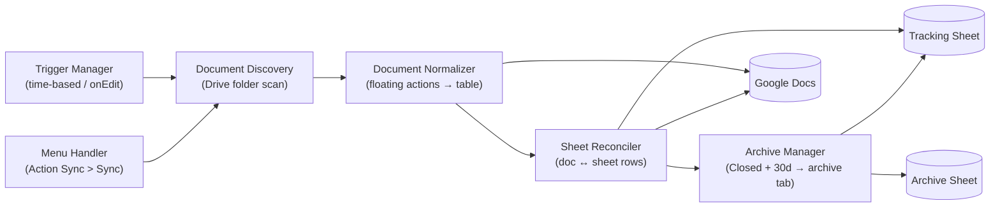
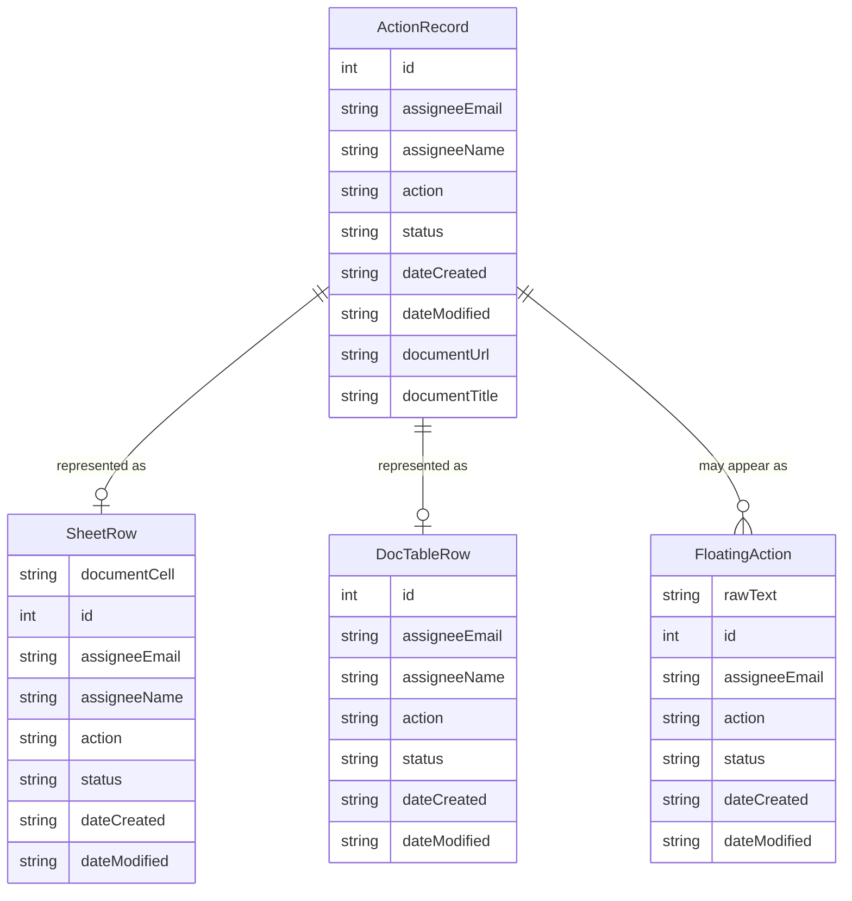

# DESIGN — GActionSheet

## Solution Strategy
GActionSheet runs entirely within Google Apps Script as a container-bound script on the tracking Spreadsheet. This keeps the Sheet as the authoritative hub with no external infrastructure. DocumentApp provides access to source Docs; SpreadsheetApp owns the sheet side. All sync logic is pull-based: the script reads documents, normalizes them, then reconciles with the sheet — avoiding the need for Doc-bound triggers.

---

## Runtime Architecture

---

## Building Block View

### Level 1 — System Overview

| Component | Responsibility |
|-----------|---------------|
| Trigger Manager | Installs and maintains the time-based scan trigger and the installable `onEdit` trigger; idempotent setup via `initializeTriggers` |
| Menu Handler | Adds the `Action Sync` menu to the Sheet UI on open; routes the `Sync` menu command to Document Discovery |
| Document Discovery | Reads `DOC_FOLDER_ID` script property; enumerates Docs in the folder tree modified in the last 7 days |
| Document Normalizer | Parses floating actions and the tracked-actions table; resolves conflicts by `Date Modified`; rewrites paragraphs and table rows; assigns IDs to unnumbered floating actions |
| Sheet Reconciler | Compares normalized document records with tracking-sheet rows using `(Document, ID)` as the key; applies timestamp-based conflict resolution; writes updates to sheet or document as required |
| Archive Manager | Identifies tracking-sheet rows with `Status = Closed` and `Date Modified > 30 days`; moves them to the archive sheet without altering timestamps |
| Programmatic Write Guard | Suppresses the `onEdit` trigger during script-initiated sheet writes using a script property flag, preventing false `Date Modified` updates |

---

## Data Model

---

## Dependency Rules
- Document Normalizer reads and writes Google Docs only; it does not touch the Sheet
- Sheet Reconciler reads and writes the Sheet only; document writes are delegated back to Document Normalizer
- Archive Manager reads from and writes to the Sheet only; it does not open documents
- No component imports from a sibling component — all communication flows through the sync orchestrator function

---

## Crosscutting Concepts

### Timestamp Conflict Resolution
All conflict resolution uses `Date Modified` (UTC ISO 8601). The later timestamp wins. On tie: sheet row wins. On missing timestamp: the side with a timestamp wins; if both missing, the tracked-actions table row wins.

### Programmatic Write Suppression
When the sync script writes to the Sheet, the installable `onEdit` trigger would otherwise fire and update `Date Modified`. A boolean script property flag (`SYNC_IN_PROGRESS`) is set before any programmatic sheet write and cleared in a `finally` block. The trigger handler reads this flag and returns immediately when it is set.

### Idempotence
A sync run that finds no timestamp differences shall make no writes to any document or sheet row. This is enforced by comparing normalized values before writing.

---

## Test Model

### E2E Framework

| Item | Value |
|---|---|
| Framework | `pytest` + `python-docx` + `openpyxl` + Playwright (Node.js) |
| Run command | `uv run pytest tests/` |
| Trigger mechanism | Playwright drives the Apps Script editor (`gas-editor-testing` pattern) to run GAS functions directly — no web app endpoint required |
| Declared methodology | `atdd-bdd` |

### Fixture Scope Architecture

| Scope | Established once per | What it provides |
|---|---|---|
| **Session** | Test run | Authenticated Playwright browser session (`.auth/user.json`); `local.settings.json` loaded (test sheet ID, test doc ID, script ID, log dir) |
| **Suite** | Feature group (one AC cluster) | Known document state reset via `setupTestFixtures()` GAS function; fresh GAS log directory cleared |
| **Workflow** | Individual AC scenario | Specific floating-action paragraph(s) inserted and/or sheet rows seeded to the exact precondition state for that scenario |
| **Function** | Individual assertion | Downloaded `.xlsx` / `.docx` snapshot of sheet and doc after sync completes |

### Workflow Sequences

#### `AC-1` — New floating action receives sequential ID and appears in sheet

| Step | Given | When | Then |
|---|---|---|---|
| 1 | Test doc contains `AI- @test@example.com \| Fix the bug \| Open`; tracked-actions table is empty | `syncDocument(testDocId)` runs via editor | GAS execution log shows `sync.complete` |
| 2 | — | Download doc as `.docx` | Floating action paragraph text starts with `AI-1` |
| 3 | — | Download sheet as `.xlsx` | Tracking sheet row exists with `ID=1`, `Action="Fix the bug"`, `Document` cell has hyperlink to test doc URL |

#### `AC-2` — Floating action with existing ID preserves that ID

| Step | Given | When | Then |
|---|---|---|---|
| 1 | Test doc contains `AI-5 @test@example.com \| Review PR \| Open` | `syncDocument(testDocId)` runs | GAS log shows `sync.complete` |
| 2 | — | Download doc as `.docx` | Tracked-actions table row has `ID=5` |
| 3 | — | Download sheet as `.xlsx` | Sheet row has `ID=5`; no row exists with any other ID for this action |

#### `AC-3` — Document record with later timestamp wins; sheet row updated

| Step | Given | When | Then |
|---|---|---|---|
| 1 | Sheet row has `Date Modified = T-1h`; tracked-actions table row has `Date Modified = T` (newer) and `Status="Done"` | `syncDocument(testDocId)` runs | GAS log shows `sync.sheet-updated` |
| 2 | — | Download sheet as `.xlsx` | Sheet row `Status` cell = `"Done"`; `Date Modified` cell is a Date value matching `T` |

#### `AC-4` — Sheet row with later timestamp wins; document updated

| Step | Given | When | Then |
|---|---|---|---|
| 1 | Tracked-actions table row has `Date Modified = T-1h`; sheet row has `Date Modified = T` (newer) and `Status="In Review"` | `syncDocument(testDocId)` runs | GAS log shows `sync.doc-updated` |
| 2 | — | Download doc as `.docx` | Tracked-actions table row `Status` = `"In Review"` |
| 3 | — | Download doc as `.docx` | Matching floating action paragraph contains `In Review` |

#### `AC-5` — Second sync is idempotent

| Step | Given | When | Then |
|---|---|---|---|
| 1 | AC-1 scenario has already completed successfully | `syncDocument(testDocId)` runs a second time | GAS log shows `sync.complete` with `changes=0` |
| 2 | — | Download sheet as `.xlsx`; compare byte-for-byte to first download | Sheet content is identical |
| 3 | — | Download doc as `.docx`; compare tracked-actions table content to first download | Doc table content is identical |

### Atomic Tests

| Category | Example | Rationale |
|---|---|---|
| Floating-action parsing | `AI-12 @a@b.com \| action \| Open` → correct field extraction | Many format edge cases; faster and cheaper than full sync round-trip |
| Assignee token forms | Bare email, display-name, mention chip all resolve to correct email | Form detection logic is isolated and boundary-heavy |
| ID assignment ordering | Three unnumbered `AI-` in one doc assigned in document order | Determinism requirement; hard to observe in full E2E |
| Timestamp parsing | ISO 8601 string → UTC Date round-trip | Locale and timezone edge cases; catches conversion bugs before they corrupt data |
| Conflict resolution rules | Tie-breaking, missing-timestamp cases | Six distinct rules; cheaper to unit-test than to construct E2E fixtures for each |

### Anti-Patterns

- **Re-authenticate per test**: Auth state is expensive (OAuth flow); establish once per session via `.auth/user.json`.
- **Hard-code sheet/doc IDs in tests**: All IDs come from `local.settings.json`; no IDs in committed test code.
- **Assert on GAS execution log alone**: Log proves the script ran; `.xlsx`/`.docx` download proves the output is correct. Both are required for AC verification.
- **Skip fixture reset between suites**: Each suite must call `setupTestFixtures()` to guarantee a known starting state; leftover data from prior suites causes false passes.
- **Download once and re-use across steps**: Download fresh after each sync; stale snapshots hide idempotence failures.

---

## References
| Document | Location | Covers |
|----------|----------|--------|
| Original requirements (archived) | /knowledge-base/references/requirements-original-2026.md | Full functional specification (superseded by CONTEXT.md) |
| GAS best practices | /mnt/c/dev/GAS-Practices/best-practices/ | Deployment, xlsx download, server logging, editor-testing patterns |
