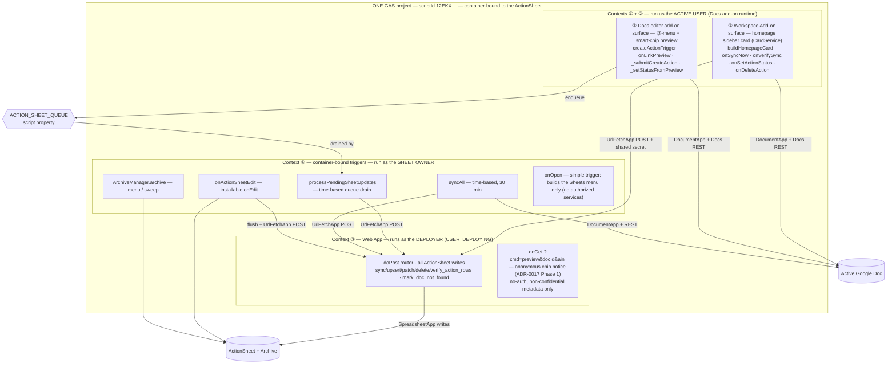
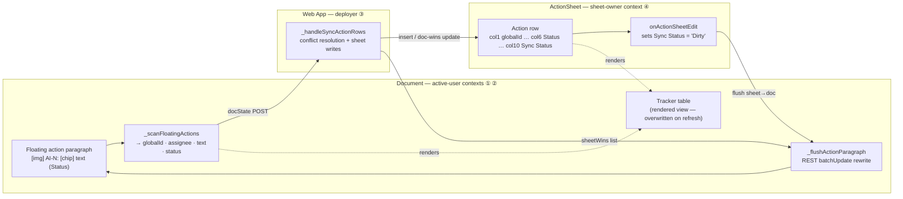
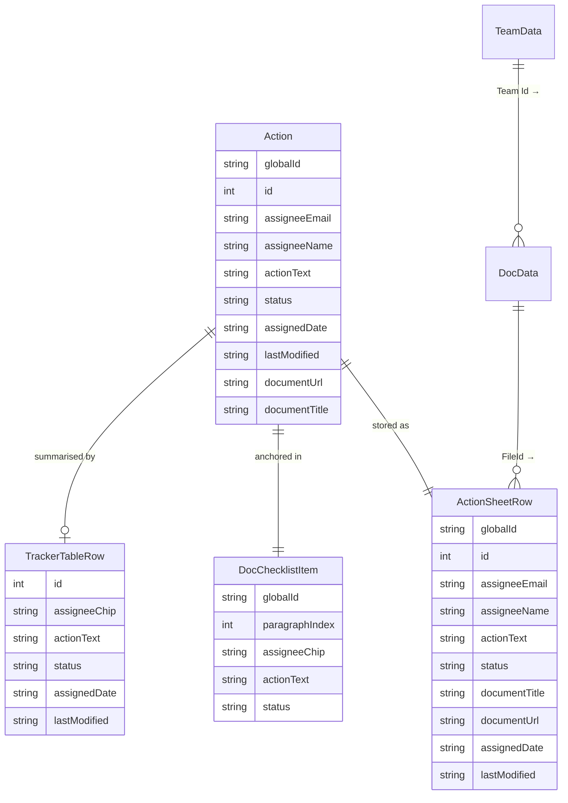
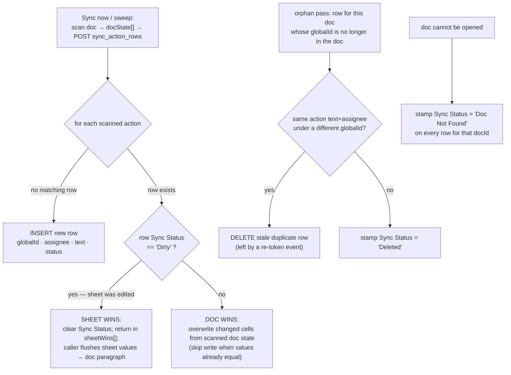
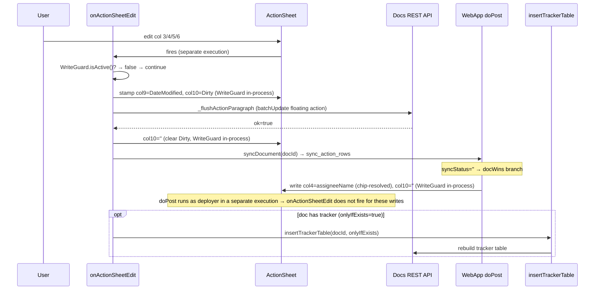

# DESIGN — GActionSheet

## Solution Strategy
GActionSheet is **one** GAS project (`scriptId 12EKX…`), container-bound to the ActionSheet spreadsheet, deployed simultaneously as a **Workspace Add-on**, a **Docs editor add-on**, and a **Web App**. All logic lives in one codebase; the same source runs in several distinct **execution contexts** (see §Runtime Architecture → Execution contexts) that differ by *what triggers them* and *whose identity they run as*.

- The **Workspace Add-on surface** renders the homepage sidebar card in the active document using **CardService** (not HtmlService). It lists the doc's actions and offers Sync, VerifySync, tracker insert/refresh, per-action status, and delete. Runs as the **active user**.
- The **Docs editor add-on surface** adds an `@`-menu **Create action** entry and a **smart-chip link-preview** card with inline status controls. It shares the same `addOns.docs` manifest section as the Workspace surface (they coexist; no mode switch) and also runs as the **active user**.
- The **Web App** (`doPost`) is a proxy endpoint. Because the add-on surfaces run as the active user — who may not have edit access to the restricted ActionSheet — all sheet writes are routed through `doPost`, which runs as the **deployer** (`executeAs: USER_DEPLOYING`) and holds sheet-write authority.
- The **container-bound automation** (`onActionSheetEdit` installable trigger, 30-minute `syncAll` sweep, archive job, async `ACTION_SHEET_QUEUE` drain) runs as the **sheet owner** via installable/time-based triggers on the ActionSheet.

Stable action identity is an **in-text `AI-N:` token** at the start of each floating-action paragraph; the cross-document key is `globalId = {docFileId}/AI-{N}`, stored in ActionSheet column 1. DocumentApp is used for read-side traversal (the token is visible to `getText()`, and PERSON chips are exposed ergonomically); the Docs REST API `batchUpdate` is used for write-side paragraph rewrites and tracker-table mutation. **No named ranges are created for actions** — the only named range in a document is the tracker-table heading anchor.

> **Identity history.** Earlier designs anchored actions with Docs REST *named ranges* (ADR-0005); this was abandoned because smart-chip / rich-link pill elements are invisible to `getText()`, forcing a text-token scanner. The current model is recorded in **ADR-0008**, the single-project architecture in **ADR-0007**, and conflict resolution in **ADR-0009**. The in-code field and ActionSheet column header are both `globalId`.

## Contract Sources


Human-readable contract semantics live in this document. The authoritative machine-readable contract source is [src/ContractSchema.js](../src/ContractSchema.js).

**Workflow for contract changes:**
- Update ContractSchema.js as the single source for any contract field or structure changes.
- Re-export the schema as JSON for test consumption if needed.
- Update scenario tests and fixtures to consume the new schema version.
- Document any semantic changes here; do not duplicate field lists.

Current contract families owned by that schema file:

- `ActionItem` field set for action-content payloads and test seeding.
- `SheetAction` field set plus ActionSheet headers and column mapping.
- Web App `doPost()` route names.
- Document-read model names used by verification and scenario-test helpers.

Rule: when tests, fixtures, and app code need the exact same field list or column mapping, they should read or derive it from [src/ContractSchema.js](../src/ContractSchema.js) rather than redefining it locally. If a semantic explanation is needed, this document is the place for it.

---

## Deployment Architecture

### Single-script dual-deployment

One GAS project (`scriptId: 12EKX7dQiO1Wf7rvv94Adgpbh3nac0OetsZMTD_1lme3y2o1KLYdKcTXi`) is container-bound to the ActionSheet spreadsheet. It is deployed simultaneously as:

- A **Workspace Add-on** (sidebar card in Docs/Sheets)
- A **Web App** (HTTP endpoint for proxy writes)

Both modes share the same source files. The `rootDir` in `.clasp.json` is `src/`; `appsscript.json` declares both `addOns` and `webapp` sections. Stable deployment IDs are maintained via `clasp deploy -i <id>` so URLs never change across pushes.

### Identity boundary and proxy-write pattern

Workspace Add-ons run as the active user. The ActionSheet is a restricted resource — end users should not have direct edit access. The Web App runs as the deployer (`executeAs: USER_DEPLOYING`), which has sheet-write authority.

```
[Add-on sidebar]
      |
      | UrlFetchApp.fetch(WEBAPP_URL, { method: 'post', payload: JSON })
      v
[doPost — runs as deployer]
      |
      | sheet.appendRow(...)
      v
[ActionSheet]
```

Authentication between add-on and Web App uses a shared secret (`WEBAPP_SECRET` script property). Apps Script Web Apps do not propagate Google identity via Bearer tokens.

### URL stability and org normalization

On northlakeuu.org, `ScriptApp.getService().getUrl()` returns:
`https://script.google.com/a/northlakeuu.org/macros/s/<id>/exec`

This is normalized in `doGet` to the canonical form:
`https://script.google.com/macros/s/<id>/exec`

and stored in the `WEBAPP_URL` script property so a single `urlFetchWhitelist` entry matches. `WEBAPP_URL` is updated automatically on each Web App visit; no manual copy-paste after redeployment.

### Module Map

Context column refers to the execution contexts defined in §Runtime Architecture (① Workspace add-on, ② editor add-on, ③ Web App, ④ container-bound triggers).

| File | Role | Context |
|------|------|---------|
| `src/WorkspaceAddonCard.js` | Workspace homepage card builder with DocStatus/Import/Notify tab navigation (`_buildTabbedHomepageCard`, `_TABS` registry, `onShowTab`) + button/mutation handlers (Sync, VerifySync, status, delete) — CardService | ① |
| `src/EditorAddonCard.js` | Docs editor add-on: `@`-menu create-action card, smart-chip `onLinkPreview`, preview status taps, `ACTION_SHEET_QUEUE` enqueue — CardService | ② |
| `src/ContractSchema.js` | Authoritative machine-readable contract definitions shared by app and tests | all |
| `src/SyncManager.js` | Scanner (`_scanFloatingActions`), token assignment, `syncDocument` / `syncAll`, REST paragraph flush (`_flushActionParagraph`), shared chip-badge style (`_chipBadgeStyleRequest`), chip URL base (`ACTION_CHIP_URL_BASE`), `onActionSheetEdit` | ① ② ④ |
| `src/WebApp.js` | `doGet` (self-register URL; `?cmd=preview` anonymous chip notice, ADR-0017 Phase 1), `doPost` router + all sheet writes | ③ |
| `src/TrackerTable.js` | Insert/refresh the in-doc tracker table (DocumentApp + REST) | ① ② ④ |
| `src/VerifySync.js` | Non-mutating doc ↔ tracker ↔ sheet verification | ① |
| `src/WriteGuard.js` | In-process suppression of `onActionSheetEdit` during programmatic writes | ④ |
| `src/SheetSetup.js` · `src/TriggerManager.js` · `src/ArchiveManager.js` | Sheet structure, installable-trigger install, archive job | ④ |
| `src/MenuHandler.js` | `onOpen` Sheets menu (simple trigger) + test menu items | ④ |
| `src/GasLogger.js` | Buffered NDJSON logger to Drive | all |
| `src/Version.js` | `BUILD_INFO` + `getWebAppUrl`; stamped by `update-revision.js` | all |
| `src/appsscript.json` | Manifest — `addOns.docs` (homepage + createAction + linkPreview), webapp, oauthScopes, urlFetchWhitelist | — |
| `src/TestWebApp.js` · `src/TestFixtures.js` | HTTP fixture dispatcher + GAS test fixtures (test-only) | ③ |

**Add-on surface file naming.** Surface files use the convention `{Surface}Addon{UITech}.js`, where the suffix marks the rendering technology: `…Card.js` = CardService (Workspace Add-on), `…Html.js` = HtmlService (Editor add-on / menu-launched sidebar, reserved for future rich UIs such as an LLM side-chat). Host-agnostic logic (sync engine, Web App proxy, tracker, verify, logger) stays unsuffixed in the shared core. See the naming-conventions section of `staging/2026-05-29-workspace-addon-toolset-direction.md` (repo-root `staging/`, distinct from `knowledge-base/staging/`) for the rationale and the forward plan.

### Deployment Pipeline

```
npm run deploy:test
  └─ update-revision.js        → stamps src/Version.js with version + timestamp
  └─ manage-deployments.js     → finds TEST-WEB-APP deployment by anchor string
                                  clasp push (--force if needed)
                                  clasp deploy -i <id> -d "<description>"
                                  writes .deploy-metadata.json
```

Release pipeline (`npm run release:patch`) additionally runs `commit-deploy-stamp.js`, which reads `.deploy-metadata.json` and commits `src/Version.js` with deployment metadata.

### Script Properties

| Property | Set by | Purpose |
|----------|--------|---------|
| `WEBAPP_URL` | `doGet` (auto) | Normalized Web App URL for UrlFetchApp calls |
| `WEBAPP_SECRET` | Manual (script editor) | Shared secret for doPost authentication |
| `ACTION_SHEET_ID` | Manual / `bootstrap()` | Fallback ActionSheet ID when `getActiveSpreadsheet()` is unavailable (e.g. tracker refresh from the add-on context) |
| `DOC_FOLDER_ID` | `ensureSheetStructure` (auto) | Parent folder of the bound spreadsheet (resolved + cached) |
| `ACTION_SHEET_QUEUE` | Editor add-on (auto) | JSON array of pending sheet updates, drained by the time-based trigger (cross-context async hand-off) |
| `GAS_LOGGER_FOLDER_ID` | Manual | Drive folder for GasLogger output (TDD phase) |
| `TEST_DOC_ID` | Manual / `bootstrap()` | Test Google Doc ID for smoke tests |
| `TEST_SHEET_ID` | Manual / `bootstrap()` | Test Sheet ID for smoke tests |
| `TEST_TOKEN` · `TEST_TOKEN_EXPIRES` | `set_test_token` (deploy) | Per-deployment token + expiry gating the `run_fixture` test route |

### urlFetchWhitelist

Required in `appsscript.json` for any Workspace Add-on that calls `UrlFetchApp`. Three entries cover all URL format variants produced by northlakeuu.org:

```json
"urlFetchWhitelist": [
  "https://script.google.com/a/macros/northlakeuu.org/s/",
  "https://script.google.com/a/northlakeuu.org/macros/s/",
  "https://script.google.com/macros/s/"
]
```

Omitting `urlFetchWhitelist` produces a hard error at call time, not a manifest validation error.

### Deployment Constraints

- Web App access must be **"Anyone"** (not "Anyone within org") — org SSO enforces authentication on `UrlFetchApp` requests regardless of headers when set to org-restricted
- Web App `executeAs` must be **"USER_DEPLOYING"** to have sheet-write authority
- `urlFetchWhitelist` is mandatory for any UrlFetchApp call from a Workspace Add-on

---

## Runtime Architecture

### Execution contexts

The single project runs in **four execution contexts**. A context is one GAS execution defined by *what triggers it* and *whose identity it runs as* — **not** a separate project or OS thread. GAS executions are isolated and share no memory; the only cross-context channels are HTTP (`UrlFetchApp` → `doPost`), the `ACTION_SHEET_QUEUE` script property (async hand-off), and the ActionSheet rows.



**Identity boundary.** Contexts ① and ② run as the active user: they can read the active Doc but may **not** write the restricted ActionSheet directly — every sheet write is proxied to context ③ (the deployer). Context ④ runs as the sheet owner and writes the sheet directly, calling ③ only to reuse the same doc-flush path. ① and ② share one identity and one manifest section (`addOns.docs`) but are distinct *surfaces* with different entry triggers. `onOpen` is a **simple** trigger and must not call authorized services (so `GasLogger.flush()` — a `DriveApp` write — is omitted there).

### Data flow

An action's data lives on three surfaces but only **two are authoritative** (the doc paragraph and the ActionSheet row); the tracker table is a rendered, non-authoritative view. This shows how a change on either authoritative side propagates.



There is no shared in-memory state between the doc-side contexts and the sheet — communication is **only** `doPost` (HTTP) and the ActionSheet rows.

---

## Building Block View

Grouped by execution context (see §Runtime Architecture).

### ① Workspace Add-on surface (active user)

| Component | Responsibility |
|-----------|---------------|
| Tab navigation | `_buildTabbedHomepageCard(activeTab, …)` renders, in order: shared header (`_buildHomepageHeader`) → tab-bar section (`_buildTabBarSection`, a ButtonSet of TextButtons — active tab styled FILLED, every tab including the active one fires `onShowTab` with `{tab: id}`; CardService requires every TextButton to carry an onClick action, so re-selecting the active tab is a harmless no-op re-render) → the active tab's body → version footer. `buildHomepageCard()` is a thin delegator to `_buildTabbedHomepageCard('docStatus', …)`, so all existing entry points land on DocStatus unchanged. The `_TABS` registry (`docStatus`, `import`, `notify`) drives both the tab bar and `onShowTab` dispatch; adding a tab (e.g. a future Settings tab) is a registry entry plus a body builder |
| Homepage card — DocStatus tab | Renders the DocStatus tab body for the active doc using CardService. Sections: (1) overview — sync state and record count; (2) action buttons — **Sync now**, **VerifySync**, **Insert tracker** (hidden when a tracker is already present); (3) action list — each action shows status icon buttons (Open / In Progress / In Review / Done / Closed) firing `onSetActionStatus`, and a **Delete** button firing `onDeleteAction`. Mutations complete a full doc+sheet round-trip before returning the refreshed card |
| Homepage card — Import / Notify tabs | Placeholder bodies (`_buildImportTabSection`, `_buildNotifyTabSection`) showing "Import — coming soon" / "Notify — coming soon". Business logic lands in EPIC-D (Import) and EPIC-E (Notify) |
| VerifySync | Reads floating actions from the doc, reads ActionSheet rows for the same doc via a non-mutating Web App call, parses the in-doc tracker table when present, and reports progress plus mismatches; a floating action without an explicit trailing `(Status)` token is itself a verification failure |

### ② Docs editor add-on surface (active user)

| Component | Responsibility |
|-----------|---------------|
| Create-action card | `@`-menu entry (`createActionTrigger`); form for action text, optional assignee (People-API suggestions), and status. On submit, inserts the branded `AI-N:` fragment at the cursor via REST, then upserts the row through the Web App |
| Smart-chip preview | `onLinkPreview` matches the action URL pattern and renders a card with the action's current state plus status icon buttons; a tap rewrites the doc paragraph and enqueues the sheet update on `ACTION_SHEET_QUEUE`, drained asynchronously by context ④ |

### Shared sync engine (used by ①, ②, ④)

| Component | Responsibility |
|-----------|---------------|
| Action Scanner | `_scanFloatingActions` walks the doc body; a floating action is any paragraph/list-item whose text starts with the token `AI-N:` (an optional leading inline image is ignored). After the token it extracts an optional assignee (PERSON chip, or a leading email whose name is derived from the local-part), the action text, and the trailing `(Status)` token. Duplicate `AI-N` paragraphs (copy/paste) are flagged `isDuplicate` |
| Token Manager | `_assignPlaceholderTokens` finds bare `AI:` placeholders and assigns the next free `N`. The global key `globalId = {docId}/AI-{N}` is the durable identity; there is **no** named-range bookkeeping for actions |
| Paragraph flush | `_flushActionParagraph` rewrites every occurrence of an `AI-N:` paragraph in place via one REST `batchUpdate` (image → token → optional chip → text → status badge), keeping copies consistent with the canonical row |
| Tracker Table Renderer | Inserts/refreshes the in-doc tracker table anchored by its heading named range (`gactionsheet-tracker-anchor`), preceded by a read-only-notice paragraph; uses REST `batchUpdate` for in-place replacement |

### ③ Web App — `doPost` (deployer)

| Component | Responsibility |
|-----------|---------------|
| Sync handler | `_handleSyncActionRows`: for each scanned action, inserts a new row, or (row exists) applies **Dirty-flag conflict resolution** — `Sync Status = 'Dirty'` → sheet wins (returned in `sheetWins` for the caller to flush doc-ward); otherwise doc wins (overwrite changed cells). Also removes stale duplicate rows and stamps orphans `Deleted` / `Doc Not Found`. All writes wrapped by the in-process `WriteGuard` |
| Production routes | `sync_action_rows` (blocks until `ACTION_SHEET_QUEUE` drains), `upsert_action_rows` (editor create + async drain), `patch_action_status` / `delete_action_row` (sidebar fast paths), `list_importable_actions` (EPIC-D, read; team-scoped via DocData join + `assertTeamAccess`), `forward_action_rows` (EPIC-D; sets `Status='Forwarded'` + dirty-flags the source row) — auth: `WEBAPP_SECRET` |
| Test-support routes | `edit_action_row` (replicates `onActionSheetEdit` Dirty+DateModified stamp), `find_sheet_actions` (read, docId-scoped), `append_doc_paragraph`, `patch_action_status` / `delete_action_row` ATDD wrappers (stamp Dirty so sheet-wins applies), `verify_action_rows`, `mark_doc_not_found`, `import_selected_for_test` (EPIC-D test seeding), `set_test_token`, `run_fixture` — auth: `testToken`; defined in `ContractSchema.js webApp.testRouteNames` |
| ATDD session routes | `begin_journey_session` (empty-create doc named `GActionSheet-Test-journey-{YYYYMMDD}-{hex}` in test folder), `end_journey_session` (trash doc) — auth: `testToken`; defined in `src/AtddContracts.js` |

### ④ Container-bound automation (sheet owner)

| Component | Responsibility |
|-----------|---------------|
| onActionSheetEdit | Installable `onEdit`; on a user edit to cols 3–6 it stamps `Date Modified` (col 9) and `Sync Status = 'Dirty'` (col 10), then flushes the row to the doc and re-syncs. Returns immediately if `WriteGuard.isActive()` (a programmatic write is in progress) |
| Sweep (`syncAll`) | Time-based (30 min); enumerates unique doc IDs from the column-7 hyperlink formulas and calls the **same** `syncDocument` the sidebar uses — no separate reconcile code |
| Archive Manager | Moves rows with `Status = Closed` and `Date Modified > 30 days`, or `Sync Status = Doc Not Found` and `Date Modified > 24 hours`, to the Archive sheet without altering timestamps; bottom-to-top deletion; writes wrapped by `WriteGuard` (GTaskSheet-0f0s) |
| Write Guard | In-process flag (`WriteGuard._active`) set around every programmatic sheet write and read by `onActionSheetEdit` to skip re-stamping. The cross-execution variant is disabled — see §Programmatic Write Suppression |

---

## Data Model



The cross-doc key is `globalId = {docId}/AI-{N}`, stored in ActionSheet column 1. The doc-scoped `id` (column 2) is the human-facing `AI-N` derived from that key; `N` is assigned once per document by the Token Manager and then persists in the paragraph text — it is stable, not recomputed from document order.

> The field in all three entities is `globalId`. The ActionSheet column heading is `globalId`.

**Field notes:**
- `assigneeChip` — compound value extracted from the PERSON chip, canonical form `name <email>`. The ActionSheet stores this in two separate columns (`Assignee Name`, `Assignee Email`); `DocChecklistItem` and `TrackerTableRow` hold it as a single parsed unit.
- `documentTitle` / `documentUrl` — the ActionSheet renders these as a single hyperlink cell (display text = `documentTitle`, URL = `documentUrl`). Modelled separately here to mirror `Action` and make the hyperlink structure explicit.

---

## Team Scope Schema (ADR-0014)

Documents are tagged with a logical **Team ID** so actions can be filtered and reported by
team from the master sheet. Team ID is a `Folder Id` value — the folder that matched during
folder-walk auto-assignment. This section describes the three schema additions and their
interaction; the synchronisation behaviour is implemented in EPIC-B.

### TeamData tab (admin-managed)

| Column | Purpose |
|--------|---------|
| Team Id | Stable team identifier; equals the Team's Folder Id (e.g. `Board`, `Membership`). Display name and identity are currently the same field; a separate `Team Name` display field is a future addition. |
| Folder Id | Drive folder ID owned by this team; the folder-walk match key |
| Contact | Team contact for coordination/notifications |

Multiple rows may share a Team Id (a team may own several folders).

### DocData tab (per-document sync state)

| Column | Updated by | Used by |
|--------|------------|---------|
| FileId | Set once on first insert | FK → ActionSheet `File Id`; row lookup key |
| Doc Name | Every full sync and reconciliation pass | Display only |
| Last Sync Time | `_syncTeamScope` — stamped on every FULL document sync for this doc | Diagnostic only. **Not** Drive's true last-modified time — that value is read transiently during `syncAll`'s skip check and discarded, never persisted. Preserved unchanged by callers that upsert without running a full sync (integrity pass, `sync_action_rows` handler). |
| Doc Updated | `_getOrUpsertDocDataRow` — stamped unconditionally on every write to this row, for any reason | `ArchiveManager` — the staleness clock for evicting Doc Not Found rows after 24h. Relies on no other upsert path touching a row once it is marked Doc Not Found, so this value freezes at the moment of marking. |
| SyncStatus | `UpdateDoc` → push `DocData.Team Id` to document property on next sync |
| Team Id | Team ID assigned to this document (matches a `TeamData.Folder Id`) |
| Action Count | Total actions for the document |
| Resolved Count | Total actions resolved per the shared `isResolved()` authority |

`Last Sync Time` and `Doc Updated` normally move together (the same sync execution stamps both). They diverge only when the integrity-reconciliation pass updates action counts for a doc the Drive-mtime skip check decided not to re-sync: `Doc Updated` bumps, `Last Sync Time` does not.

**DocWins:** when the document was modified since last sync, DocData is updated from
document state. The one exception: if `SyncStatus == 'UpdateDoc'`, DocData wins — the team
assignment in `DocData.Team Id` is written to the document and `SyncStatus` is cleared.

### ActionSheet — `File Id` column

One column added to the existing ActionSheet:

| Column | Purpose |
|--------|---------|
| File Id | Google Drive file ID of the source document; decomposed from the `globalId` prefix; FK → `DocData.FileId` |

Team Id is **not** stored in the ActionSheet action rows (update anomaly: team reassignment
would require rewriting N rows). Import/Notify workflows join Actions → DocData via `File Id`
to resolve Team Id.

Rows written before this column existed carry blank; not backfilled automatically.

### ActionSheet — `Date Created` / `Date Modified` contract

| Column | Updated by | Used by |
|--------|------------|---------|
| Date Created | Set once on row insert (`_handleUpsertActionRows`, `WebApp.js`); never updated afterward. On import, the source action's original `Date Created` is carried over to the new row (`createdDate` payload field) rather than reset — see rationale below. | Reporting: how long an action item has been open, independent of which document currently hosts it. |
| Date Modified | Stamped to `now` only when assignee/text/status actually changes (diff-guarded — see the `changed` check in `_handleUpsertActionRows`), by direct sheet edits (`onActionSheetEdit`), and by the various status/assignee update handlers in `WebApp.js`. | `ArchiveManager` — staleness clock for the Closed (30-day) and Doc Not Found (24h, Actions-row variant) eviction rules. Also intended to answer "how long since this action last changed," independent of which document hosts it. |

**Why Date Created must survive a migration:** importing/forwarding an action into another document does not modify the action — it relocates it. The action text, assignee, and status are carried over unchanged; only the hosting document changes. Reports that measure "how long has this been open" or "how long since this last changed" would be wrong if migration reset either timestamp, so both must be treated as properties of the action, not of its current document.

**Known gap:** `Date Created` is correctly preserved on import (`EditorAddonCard.js` passes `createdDate: src.created_date` into the `upsert_action_rows` payload). `Date Modified` is **not** — the insert path in `_handleUpsertActionRows` (`WebApp.js`) always stamps it to `now` on insert, including for an imported row whose content didn't change. This means an import currently looks like a "modification" to anything reading `Date Modified`, contradicting the contract above. Not fixed as part of this change — flagged for a follow-up decision.

### Auto-assignment algorithm

Runs on sync when the document does not yet have a `teamScope` custom property:

1. Retrieve the document's parent folder via `DriveApp.getFileById(docId).getParents()`.
2. Walk ancestors from current parent up to root/drive.
3. For each folder ID, look for an exact match in `TeamData.Folder Id`.
4. First match → set document `teamScope` to the **`Team Id`** value from that TeamData row.
5. No match after reaching root → leave `teamScope` blank; log a warning.

### Security gate

Any read filtered by document ID or Team Id must first resolve the `Folder Id` from TeamData
for that Team Id, then call `DriveApp.getFolderById(folderId)` as the active user. On failure
(no access), return no rows and surface an error. This gate is load-bearing for Import and
Notify (EPIC-D, EPIC-E).

---

## Dependency Rules
- The Scanner reads the active doc only; it never touches the ActionSheet directly — the Web App (`doPost`, context ③) owns all sheet I/O.
- Add-on surfaces never reach into each other's internals; they call the shared engine functions (`syncDocument`, `insertTrackerTable`, `verifyDocumentSync`, `_flushActionParagraph`) and the Web App proxy.
- The container-bound sweep (`syncAll`, context ④) performs the same reconciliation as the sidebar's **Sync now** by calling the **same** `syncDocument` code — there is no separate automation codebase. (This consolidated a prior stub; see the entry-point coverage rule in CLAUDE.md.)
- Archive reads/writes the ActionSheet only; it never opens documents.
- All four contexts live in one project and share code freely. The only boundary is an **identity** one: active-user contexts (① ②) must write the sheet via the deployer-context Web App (③); they never call `SpreadsheetApp` on the ActionSheet directly.

---

## Crosscutting Concepts

### Authoritative surfaces
An action exists on **three** surfaces, but only **two** are authoritative:

| Surface | Role | Edits propagate? |
|---|---|---|
| Floating action paragraph (chip + text + trailing `(Status)`) in the doc | Doc-side authority | Yes — propagated to ActionSheet on Sync |
| ActionSheet row | Cross-doc authority | Yes — propagated to floating action on Sync |
| In-doc tracker table row | Rendered view of the doc's actions | **No** — overwritten on next **Insert / refresh tracker** |

Conflict resolution applies only between the two authoritative surfaces, using the per-row **`Sync Status` (Dirty) flag** — see §Conflict Resolution. The renderer never reads tracker-table cell contents to decide anything; it always re-renders from the floating actions and the ActionSheet row pair.

### Conflict Resolution

A row may exist on both authoritative surfaces with differing values. The winner is decided **per row by the `Sync Status` flag**, not by comparing timestamps — `Date Modified` (col 9) is retained for archival age only. This realises **ADR-0009** and supersedes the timestamp scheme of ADR-0002.



The async chip-tap path (Scenario A) and the editor **Create action** path do **not** enter conflict resolution: the click/submit captures user intent at one instant, so the sheet write is an unconditional upsert (the sheet follows the doc).

### Identity
`globalId = {docId}/AI-{N}` is the durable identity, stored on every ActionSheet row (column 1) and embedded as the literal `AI-N:` token at the start of the action paragraph. During scan the engine reads the token straight from `getText()` — there is **no** index intersection and no named-range lookup. A paragraph bearing a token not yet in the sheet becomes a new row; a sheet row whose `globalId` is no longer present in the doc becomes a candidate orphan — deleted as a duplicate if the same action text + assignee now appears under a different token, otherwise stamped `Deleted`.

Bare `AI:` placeholders are upgraded to `AI-N:` on the next sync (Token Manager). Copy/pasted duplicates of a token are detected (`isDuplicate`) and rewritten to the canonical content on flush, keeping a 1:1 row-per-action pairing.

### Checked state is unreadable
DocumentApp returns `null` for `isChecked()` on every task / checklist item, and the REST API exposes no equivalent field. The visual checkbox is **decorative only**. The truthful status is the trailing `(Status)` parenthesized token on the action paragraph. Components must never branch on visual checked state.

### Status token grammar
A trailing parenthesized token at the end of the action paragraph. If the paragraph omits the token, Sync rewrites the floating action with an explicit `(Open)` token. `Closed` is recognized for archiving. Any other value (e.g. `(In Review)`, `(Blocked)`) is preserved verbatim and round-trips to the ActionSheet `Status` column. Whitespace inside the parens is trimmed on read; the canonical written form has no leading/trailing whitespace.

### Programmatic Write Suppression
`WriteGuard` suppresses `onActionSheetEdit` during programmatic sheet writes using a single **in-process** layer (`WriteGuard._active`), set around every programmatic write via `WriteGuard.wrap(fn)`. `onActionSheetEdit` calls `WriteGuard.isActive()` at entry and returns immediately when it is set. This covers writes that run in the **same** execution as the trigger — e.g. `onActionSheetEdit`'s own `Date Modified` + `Dirty` stamp and the corrections it writes back.

Web App `doPost` writes run as the deployer in a **separate** execution and were found **not** to fire the installable `onActionSheetEdit` trigger at all (verified 2026-05-29). The earlier cross-execution layer (a `SYNC_IN_PROGRESS_UNTIL_MS` script property with a 20 s window) is therefore **disabled**; `WriteGuard.wrapPersistent(fn)` remains as a no-op alias of `wrap(fn)` so WebApp.js call sites compile unchanged and the layer can be re-enabled if that runtime behaviour ever changes. See **ADR-0008** and the `WriteGuard.js` header.

---

## Idempotence
A Sync or Sweep that finds no differences shall make no writes to any doc or sheet, enforced by comparing normalized values before writing. (See the review note in `docs/design-review-05-29.md` §M2 for currently-known violations of this invariant in the update/formula write paths.)

## Future work
Per-document **tracker-sheet resolution** (a locator model letting each document resolve its own
tracking spreadsheet, instead of the single container-bound ActionSheet) is an unimplemented
proposal. It has been moved out of this as-built design to `knowledge-base/ROADMAP.md`
§"Future design: per-document tracker-sheet resolution". The related multi-tenant chip URL
(`…/action/{sheetId}/{globalId}`) is tracked there too.

**Homepage tab-navigation model** (implemented, `GTaskSheet-0r0s`): the homepage card has a
DocStatus/Import/Notify tab bar — see §Building Block View → "Tab navigation" above. Decision
recorded in `knowledge-base/adr/0015-cardservice-tab-navigation-model.md`. The open seam for a
future Settings tab (Phase 2, `GTaskSheet-5fha`) is a `_TABS` registry entry plus a body builder —
no navigation restructuring required.

---

## Sync Scenarios

Three distinct entry points trigger synchronisation. Each has a different initiating actor, write direction, and authority resolution.

### Scenario A — Status chip click (async, doc-initiated)

A user taps an action chip's status link in the preview card. The doc executes synchronously through the card handler, then a time-based trigger drains the queue asynchronously.

```mermaid
sequenceDiagram
    participant User
    participant DocCard as Doc card handler
    participant Queue as ACTION_SHEET_QUEUE (script prop)
    participant Trigger as Time-based trigger
    participant WebApp as WebApp doPost
    participant Sheet as ActionSheet

    User->>DocCard: tap status link in preview card
    DocCard->>Queue: enqueue {globalId, status, refreshTracker, ...}
    DocCard->>Trigger: schedule _processPendingSheetUpdates (.after 2s)
    Note over Trigger: fires 13–60 s later (GAS minimum)
    Trigger->>Queue: read + dedup by globalId (keep last per action)
    loop each deduplicated item
        Trigger->>WebApp: POST upsert_action_rows
        WebApp->>Sheet: upsert row cols 2,4,5,6,9 (WriteGuard in-process; doPost write does not fire onActionSheetEdit)
    end
    opt doc has tracker (refreshTracker=true)
        Trigger->>WebApp: insertTrackerTable(docId)
    end
```

**Field authority:** Web App write is the source of truth. Sheet wins because the action originated in the doc (user intent captured at click time); no conflict resolution needed.

---

### Scenario B — Sheet edit (synchronous, sheet-initiated)

A user edits col 3/4/5/6 of an ActionSheet row. `onActionSheetEdit` fires immediately in the same execution, marking the row Dirty and pushing the change to the doc, then running a full scan to write corrections (including chip-resolved name) back to the sheet.



**Field authority:** Sheet wins for status/action/email (user's edit intent). Doc wins for assigneeName (chip-resolved display name not available from sheet alone). `syncDocument` after flush reads the doc's canonical chip state and propagates the resolved name back.

---

### Scenario C — Sync Now / menu sync (bidirectional, full reconcile)

User clicks **Sync Now** in the sidebar, or **Action Sync → Sync** in the sheet menu. Full bidirectional reconcile via `syncDocument`.

```mermaid
sequenceDiagram
    participant User
    participant Addon as Add-on / MenuHandler
    participant Doc as DocumentApp
    participant WebApp as WebApp doPost
    participant Sheet as ActionSheet
    participant REST as Docs REST API

    User->>Addon: Sync Now or menu Sync
    Addon->>Doc: openById, scan floating actions
    Addon->>WebApp: POST sync_action_rows {docState, allDocGlobalIds}
    WebApp->>Sheet: for each row (WriteGuard in-process):
    Note over WebApp,Sheet: Dirty → sheetWins list (clear col10); not Dirty → docWins (update cols 3–6,9,10)
    WebApp-->>Addon: {upserted, updated, sheetWins:[...]}
    loop each sheetWins item
        Addon->>REST: _flushActionParagraph (push sheet values to doc)
    end
    Addon->>Doc: saveAndClose
```

**Field authority:** the `Sync Status` flag determines the winner per row (see §Conflict Resolution; `Last Modified` is **not** compared). If `Sync Status = 'Dirty'`, sheet wins and its values are flushed to the doc. Otherwise the doc's scanned state overwrites the sheet row when values differ. Tracker refresh follows automatically when anything changed, and is also available as a separate user action (Insert / refresh tracker).

---

## Test Model

### Framework

| Item | Value |
|---|---|
| Framework | `pytest` + `python-docx` + `openpyxl` + Playwright (Node.js) |
| Run command | `uv run pytest tests/ -x -v` |
| Trigger mechanism for end-to-end tests | Use HTTP fixtures and Web App test hooks for setup whenever UI is not under test; use Playwright only for the live homepage card interactions in Docs (for example **Scan card**, **Sync now**, and action-list rendering). For sweep / archive tests, Playwright runs the automation script's functions from the Apps Script editor |
| Declared methodology | `atdd-bdd` (end-to-end first; atomic tests support root-cause isolation) |

### Fixture Scope Architecture

| Scope | Established once per | What it provides |
|---|---|---|
| **Session** | Test run | Authenticated Playwright browser session (`.auth/user.json`); `local.settings.json` loaded (test doc ID, test ActionSheet ID, add-on script ID, automation script ID, log dir); journey doc created via `begin_journey_session` (test-support route) |
| **Journey** | Canonical end-to-end scenario | Single test document with a known initial state (empty or seeded with floating actions) used across all five acts of the §16.10 journey test; state reset via HTTP fixture routes (not a GAS setup function) |
| **Atomic test** | Individual concern (chip extraction, token parsing, orphan reconciliation, etc.) | Specific floating actions or ActionSheet rows seeded to the exact precondition state via HTTP fixture routes; assertions on the scanned output without a full round-trip Sync |
| **Function** | Individual assertion | Fresh `.xlsx` snapshot of the ActionSheet and `.docx` snapshot of the doc after the user action completes |

### Canonical Journey

The **§16.10 Journey** (`tests/test_journey.py`) is the single end-to-end test that asserts user-visible outcomes across all four Sync scenarios (Scenario A: chip-tap, Scenario B: sheet-edit, Scenario C: sidebar sync, Scenario D: archive sweep):

- **Acts 1–5:** empty-create doc → populate with floating actions → sheet-edit + queue-drain → set_status + conflict resolution → editor UI chip hover/preview
- **Entry points covered:** Sidebar Sync (Act 3), Sheet edit + `onActionSheetEdit` trigger (Act 4), Status tap in chip preview (Act 5), time-based archive sweep (separate scenario)
- **Assertions:** Full surface coverage per §16.7 (DOC, SHEET, TRACKER, UI consistency); mechanical deviations D1, D3–D4 documented in test file header
- **Fixture approach:** HTTP test-support routes (`begin_journey_session`, `end_journey_session`, `append_doc_paragraph`, `edit_action_row`) provide setup without calling a GAS setup function

### Atomic Tests

Focused tests isolate root causes that would otherwise cascade through the slow journey scenario. Each test exercises one concern:

| Concern | What it tests |
|---|---|
| Chip extraction | A PERSON chip as the first inline child resolves to `(email, name)`; a paragraph without a chip is correctly rejected |
| Status token parsing | `... (Open)`, `... (In Review)`, `...   (  Closed  )`, missing token, multiple parens — all parse to the right `(status, actionText)` pair |
| Token survival | After an edit inserts text above an action, the `AI-N:` token is still scanned from the paragraph and resolves to the same `globalId` |
| Free-form status preservation | `(In Review)` round-trips through Sync without normalization to `Open` or `Closed` |
| Duplicate / orphan reconciliation | A row whose `globalId` is gone from the doc but whose `(assigneeEmail, actionText)` reappears under a different `AI-N` is removed as a stale duplicate; a genuinely removed action is stamped `Deleted` |
| Write Guard | A programmatic ActionSheet write performed with `WriteGuard.wrap()` does not fire `onActionSheetEdit` |

### Anti-Patterns

- **Branch on visual checked state.** Checkbox state is not readable; code must never call `isChecked()` as a source of truth. The trailing `(Status)` token is the authoritative status.
- **Assert on execution log alone.** The log proves the script ran; the `.docx` / `.xlsx` / sidebar contents prove the output is correct. Both are required.
- **Hard-code IDs in tests.** All IDs come from `local.settings.json`; no IDs in committed test code.
- **Re-authenticate per test.** Auth state is expensive; establish once per session via `.auth/user.json`.
- **Skip the atomic tier before running the journey.** A root-cause failure in chip extraction will fail the journey; fix atomic tests first, then run the journey test.
- **Use a GAS setup function to establish fixture state.** All test setup happens via HTTP fixture routes (HTTP calls to the Web App's test-support routes). This keeps setup transparent and auditable.

---

## ATDD Journey Pre-Code Contract

_Durable design record for the §16.10 canonical journey (GTaskSheet-5vwu). Authoritative shapes live in `src/ContractSchema.js` and `src/AtddContracts.js`._

### Three-tier route ownership

| Tier | Auth | Source | Routes |
|------|------|--------|--------|
| Production | `WEBAPP_SECRET` | `ContractSchema.js webApp.routeNames` | `sync_action_rows`, `patch_action_status`, `delete_action_row`, `upsert_action_rows`, `list_importable_actions`, `forward_action_rows` |
| Test-support | `testToken` | `ContractSchema.js webApp.testRouteNames` | `edit_action_row`, `find_sheet_actions`, `append_doc_paragraph`, `patch_action_status` (ATDD wrapper), `delete_action_row` (ATDD wrapper), `verify_action_rows`, `mark_doc_not_found`, `import_selected_for_test`, `set_test_token`, `run_fixture` |
| ATDD session | `testToken` | `src/AtddContracts.js` | `begin_journey_session`, `end_journey_session` |

### Completion-signal model (response-based — no log polling)

- `sync_action_rows` — **synchronous**; blocks until `ACTION_SHEET_QUEUE` drains before responding. A following `sync()` call is guaranteed to find the queue empty.
- `patch_action_status` — **asynchronous**; enqueues and returns immediately. Converges to a consistent state on the next `sync()` call.
- All other routes — synchronous; response body is the result.

### Key semantics

- **`edit_action_row`** replicates `onActionSheetEdit` semantics on the API/fixture path: stamps `Dirty` + `DateModified` so the edit survives the next sync via sheet-wins (§16.11 #2). When the same gesture is driven through the Playwright UI, the real `onActionSheetEdit` trigger fires and no replication is needed.
- **All write routes** address their target row by `globalId`, not physical row index (§16.11 #3).
- **`begin_journey_session`** creates an empty doc via `DocumentApp.create`, named `GActionSheet-Test-journey-{YYYYMMDD}-{hex}`, in the same Drive folder as the test sheet. `end_journey_session` trashes it.
- **`doc_id` / `doc_name`** are DERIVED from the `document_formula` hyperlink (col 7), not stored columns. `SheetReader` must parse them; they are not available as direct sheet fields.
- **ATDD wrappers** for `patch_action_status` and `delete_action_row` are `testToken`-gated and stamp `Dirty`, whereas the production routes are `WEBAPP_SECRET`-gated. This keeps the ATDD test path honest: a patched status survives the next sync via sheet-wins rather than being overwritten by doc-wins.

---

## References
| Document | Location | Covers |
|----------|----------|--------|
| Original requirements (archived) | /knowledge-base/references/requirements-original-2026.md | Full functional specification for the prior `AI-` prefix / container-bound-on-Sheet design (superseded) |
| Google Docs / Tasks API findings | /home/stuar/roots/g-Proj/GDocTools/DocsAPI/DOCS_API_FINDINGS.md | API capability matrix and architectural options that drove this design |
| GAS best practices | /mnt/c/dev/GAS-Practices/best-practices/ | Deployment, xlsx download, server logging, editor-testing patterns |
| ATDD lifecycle & strategy | docs/atdd/atdd-lifecycle.md | Process model, twin-ticket rule, §16 scenario definition model, §16.10 canonical journey, §16.11 resolved decisions, §17 enhancement candidates |
| Python harness architecture | docs/atdd/scenario-harness-design.md | `scn/` module layout, ownership rules, concrete signatures for §16.9 catalog |
| Scenario coverage review | docs/atdd/scenario-testing-review-2026-05-29.md | P0–P3 coverage gap findings from 2026-05-29 review |
