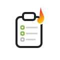

# GActionSheet — User Guide

 

GActionSheet captures action items inside your Google Docs meeting notes and rolls them up into a shared spreadsheet (the **ActionSheet**) so anyone can see what's open, who owns it, and across which documents.

---

## Getting Started

Open any Google Doc, type `@` and select **Create action** from the Action Sync section. Fill in the action text, optional assignee, and status — then click **Create**. The action chip is inserted at your cursor and synced to your ActionSheet. Hover over any chip to see its current status and assignee.

Or, even simpler: just type `AI: cknowlton@northlakeuu.org` followed by the action you want him to take, then select **Sync** from the **Extensions > Action Sync** menu to convert that — and any others like it — into action items.

That's all you need to get going — read on for the rest of what GActionSheet can do, and the concepts behind it.

---

## Key Concepts

- **Action** — a single tracked to-do, identified by an `AI-N:` token at the start of its paragraph (e.g. `AI-3: Order the new projector`). The token keeps the action's identity stable even if you edit the text around it.
- **ActionSheet** — the central spreadsheet that aggregates actions from every synced document.
- **Team** — see [Understanding Teams](#understanding-teams) below. Determines which documents' actions you can see and import.
- **Status** — every action has a status (`Open`, `In Progress`, `In Review`, `Done`, `Closed`) shown as a trailing `(Status)` tag in the document and as an icon in the sidebar.

| Status | Icon |
|--------|------|
| Open |  |
| In Progress |  |
| In Review |  |
| Done |  |
| Closed |  |
| Unknown / free-form |  |

---

## Features

### 1. Creating an Action

There are two ways to create an action:

- **Type it directly (simplest, most common)** — start a paragraph with `AI:`, optionally followed by an email address (or a person chip) to set the assignee, then your action text. The next **Sync** (see below) assigns it a permanent number, turning `AI:` into `AI-N:`.
- **Use the Create Action card** — on a new line anywhere in the document, type `@create action`. You don't need the sidebar open for this — it's a Google Docs @-menu, available wherever you can place your cursor. Fill out the small form (action text, assignee, optional status) and the add-on inserts a fully-formed action into the document for you.

### 2. Keeping Actions in Sync

**Sync Now** scans the active document for every `AI-` action, reconciles it against the ActionSheet, and writes back any changes (new actions, status changes, text edits) using **Last Modified** to resolve conflicts.

- Available from the sidebar and from the add-on's Docs menu item.
- Requires the add-on to be installed and a `northlakeuu.org` account to run interactively.
- A **background sync runs automatically every 30 minutes** across all registered documents, so edits made by someone *without* the add-on installed — adding a new `AI:` action, editing action text, or changing a status tag by hand — are still picked up and reflected in the ActionSheet (and vice versa) without anyone needing to click Sync.

### 3. Action Tracker Table

**Insert / Refresh Tracker** inserts (or updates) a view-only summary table in the document listing every action for that document — ID, Assignee, Action text, Status, Assigned Date, Last Modified.

### 4. Prior Team Actions

The **Import** button in the sidebar shows the open actions from other meetings belonging to your team. From there you can optionally bring a selected item into the current document as a new action (it gets a fresh `AI-N:` number; the original is marked `Forwarded` on the ActionSheet).

> **Note:** the current UI uses a single Import button for both *browsing* and *importing*. We're evaluating splitting this into a clearer "view old/forwardable actions" step plus a separate, explicit "import" step — tracked as [GTaskSheet-csbv.3](#) under the UX Improvements epic. Documented here as it currently behaves.

### 5. Updating an Action's Status

You can change an action's status two ways:

1. **From the sidebar** — click the status icon (or choose from the status control) next to the action in the sidebar list.
2. **From the document** — click on the `AI-N` chip and wait for the action preview card to appear (on some platforms hovering also works), then choose the new status from the card. You can also edit the document directly — change the text in the parentheses at the end of the action's paragraph (e.g. change `(Open)` to `(In Progress)`) and let Sync pick it up.

Anything that involves a sync can take a little time to settle — give it 10–20 seconds before assuming it didn't work.

### 6. Removing an Action

Use the delete icon next to an action in the sidebar to remove it from both the document and the ActionSheet.

---

## Where to Find These Features

The Docs menu is at **Extensions > Action Sync**.

| Feature | Sidebar | Docs menu (Extensions > Action Sync) | Document editing |
|---|---|---|---|
| Create Action | — | — | simplest: type `AI:`, optionally an email address, then your action text — or use `@create action` on a new line |
| Sync Now | Sync Now button | Sync | — |
| Insert/Refresh Tracker | Insert Tracker button | Insert Tracker | — |
| Prior team actions | Import button (shows results below) | — | — |
| Change status | icon / control per action | — | edit the `(Status)` text, then Sync |
| Delete action | delete icon per action | — | — |

Anything typed or edited directly in the document (a new `AI:` action, an edited action's text, or a changed `(Status)` tag) takes effect once a Sync runs — either by clicking Sync Now/Sync, or via the automatic background sync.

---

## Understanding Teams

The first time a document is synced, GActionSheet looks at where the file lives in Drive (for example, the Communications drive or the Board drive) and matches its folder against the **TeamData** sheet to assign it to a team. Once assigned, the team stays with the document.

From then on, importing and browsing other documents' open actions is scoped to that same team — you'll only see and import actions from documents belonging to your team.

---

*For administrators and contributors, see [DESIGN.md](DESIGN.md), [OPERATIONS.md](OPERATIONS.md), and [CONTEXT.md](CONTEXT.md).*
