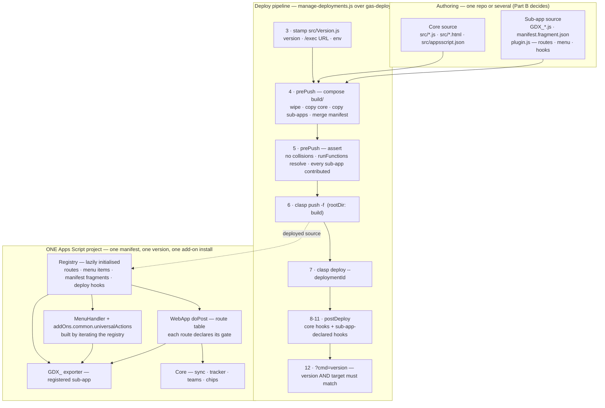
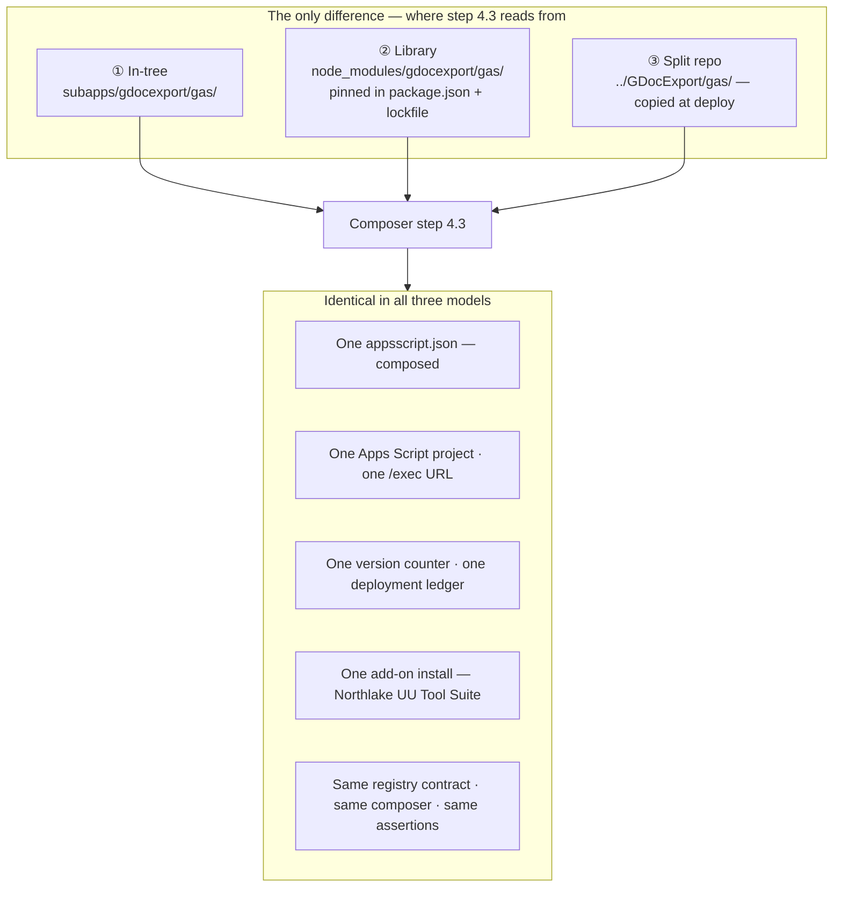

# Suite composition — deployment architecture (DRAFT)

**Status:** DRAFT — not yet agreed. Nothing here is built.
**Companion:** `knowledge-base/staging/suite-composition.md` (the staged plan).
**Purpose:** align on (A) what the deployment pipeline looks like after stages
1–4, and (B) the three module models stage 8 chooses between — *before* any of
them is built.

**Out of scope:** which model we pick. That is `module-decision` (stage 8).
This document exists so that decision is made against a shared picture.

---

## Why this document is a draft

Stages 2, 3 and 4 change the things this document describes — what gets pushed
to Google, and how a request is dispatched. A document written now and not
re-read is a document that will quietly disagree with the code.

**Review checkpoints** (each is an AC line on the stage's bead, not a note here):

| When | What to re-check |
|---|---|
| Close of `plugin-contract` (1) | Registry shape, manifest-fragment schema and the namespace rule below match the contract as authored |
| Close of `deploy-compose` (2) | The deploy sequence below matches what `manage-deployments.js` actually runs |
| Close of `gdx-namespace` (3) | §A.6's name-binding inventory matches the prefix actually applied |
| Close of `route-registry` (4) | The dispatch model below matches `WebApp.js` |
| Open of `module-decision` (8) | Part B is still an accurate statement of the three options |

If a checkpoint finds drift, this document is corrected as part of closing that
stage — it is not left for later.

---

# Part A — target state after stages 1–4

## A.1 What is true today

One Apps Script project. `clasp push` sends `src/` verbatim. `src/appsscript.json`
is hand-maintained and contains every sub-app's contributions inline. `WebApp.js`'s
`doPost` dispatches through a hand-ordered chain of `if (payload.action === …)`
statements, where **the auth gate a route gets is determined by where its `if`
sits relative to the gate checks** — implicit, and untested.

## A.2 What changes

Two things, and only two:

1. **`clasp push` sends a composed `build/`, not `src/`.** `src/` becomes core
   source, one input among several.
2. **`doPost` dispatches through a route table where each route names its gate.**
   Gate selection becomes data instead of statement order.

Everything else — one script project, one manifest, one version counter, one
deployment ledger, one add-on install for the user — is unchanged. That is
deliberate: the user-visible surface must not move while the internals do.

## A.3 Deploy sequence

`pnpm run deploy:test`. Steps 4 and 5 are new; the rest is today's pipeline.
Step 4 uses `gas-deploy`'s existing **`prePush` hook phase** — a documented slot
for "source that must be IN the push", already used in F3Go30. This is not new
deployment machinery.

| # | Step | Owner |
|---|---|---|
| 1 | Write `.clasp.json` with `rootDir: 'build'` | gas-deploy |
| 2 | Resolve the `TEST-WEB-APP` deployment id | gas-deploy |
| 3 | Bump `build`, stamp `src/Version.js` (version · `/exec` URL · env) | GActionSheet stamper |
| **4** | **prePush — compose `build/`** | **GActionSheet** |
| **5** | **prePush — assert the composition** | **GActionSheet** |
| 6 | `clasp push -f` — pushes `build/` | gas-deploy |
| 7 | `clasp deploy --deploymentId … --description "TEST-WEB-APP v…"` | gas-deploy |
| 8 | postDeploy — register `WEBAPP_URL` | deploy-hooks.js |
| 9 | postDeploy — test token, Axiom config | deploy-hooks.js |
| 10 | postDeploy — **sub-app-declared hooks** (e.g. export folder config) | sub-app |
| 11 | postDeploy — verify Script Properties, static portal build/publish/assert | deploy-hooks.js / gas-static |
| 12 | `?cmd=version` — verify version **and** target; print summary | gas-deploy |

**Step 4 — compose.** Four operations, in order:

1. **Wipe** `build/`. Never incremental: a deleted sub-app file must actually
   disappear from the push.
2. **Copy core** `src/*` → `build/`, including the `Version.js` just stamped
   (prePush runs after the stamp, which is why this works).
3. **Copy each sub-app's GAS source** → `build/`, flat. GAS has one global
   namespace and no subdirectories, which is what makes the `GDX_`-style prefix
   a correctness requirement rather than a style preference.
4. **Merge `appsscript.json`**: core manifest + each sub-app's
   `manifest.fragment.json`. Union-and-dedup on `oauthScopes`,
   `urlFetchWhitelist`, `enabledAdvancedServices`; append to
   `addOns.common.universalActions`.

**Step 5 — assert.** Composition fails silently and lands half a sub-app on real
users, so the deploy fails here instead:

- every file in `build/` traces to a known source (core, or a named sub-app)
- no filename collisions between core and any sub-app, or between sub-apps
- every `runFunction` in the merged manifest resolves to a `function <name>` in
  some `build/*.js`
- every sub-app declared in `package.json` actually contributed files

## A.4 Diagram — the deploy and dispatch path

> **Question this answers:** after stages 1–4, what path does source take from an
> author's edit to a served `/exec` response, and where do sub-apps enter it?

## A.5 Dispatch model after stage 4

Each route is a record, not a position in a chain:

| Field | Meaning |
|---|---|
| `action` | the wire string — **unchanged by any stage of *this* plan** (gts-284o's governance→document rename, resolved before stage 1, already moved `export_governance_json` → `export_document_json`; that is the last change this string sees), bound by `call_webapp.py`, `export_gas.py` and the test suite |
| `gate` | `secret` · `testToken` · `open` — was implicit in statement order |
| `handler` | function name |
| `owner` | `core` or a sub-app id — new, and what makes provenance reportable |

`?cmd=version` stays routed ahead of every gate in both `doGet` and `doPost`,
exactly as today.

## A.6 Namespace and name binding (stage 3)

GAS has one flat global namespace, so a sub-app prefix (`GDX_` proposed) is a correctness
requirement once two sub-apps share a script project, not a style preference. It is also the one
change in this plan that is worth making under **every** outcome, including never splitting
anything — so it lands at stage 3, ahead of the registry work, rather than after it.

Measured 2026-08-27: **81** global functions across `Procedure-Exporter.js` (74) and
`ExportFolderMap.js` (7). The risk is not in those — a missed *call* fails loudly. It is in the
**six string-bound name sites**, across four binding kinds, none validated by `clasp push`:

| Site | Binding kind | Fails |
|---|---|---|
| `appsscript.json:53,57` | `runFunction` (universal actions) | at runtime, for a user |
| `MenuHandler.js:62` | `addItem('Export…', 'menuShowExportDialog')` | at runtime, for a user |
| `Procedure-Exporter.js:167` | `CardService…setFunctionName('onExportBackToHome')` | at runtime, for a user |
| `ExportProgressDialog.html:141,171` | `google.script.run.<name>` | at runtime, for a user |

Stage 2's step-5 assertion is widened to cover all four kinds, which converts this whole class
from silent-runtime to deploy-time failure. That assert is why the rename sits after the
composer rather than first.

**Not renamed by any stage of *this* plan:** WebApp `action` strings and GasLogger tags. Both are
wire contract, bound by `scripts/call_webapp.py`, `scripts/export_gas.py`, the Axiom queries and
the test suite. gts-284o already renamed them once (`export_governance_json` →
`export_document_json`, `governance_export.*` → `document_export.*` log tags) as part of retiring
'governance' terminology — that is the baseline stages 1-8 build on, not a name these stages
touch again.

---

# Part B — the three module models

## B.1 The point of this section

All three models produce **the same deployed artifact**: one script project, one
manifest, one `/exec` URL, one version, one add-on install. They differ in a
single question — **where step 4.3 reads sub-app source from.**

That is worth stating plainly, because it means stages 1–6 are not a bet on any
one of them.

> **Question this diagram answers:** where exactly do the three models diverge,
> and what do they share?

## B.2 Comparison

| | ① In-tree | ② Library (pinned dep) | ③ Split repo (copy) |
|---|---|---|---|
| Sub-app source lives in | `subapps/<id>/` in this repo | its own repo, consumed as a pinned `github:` dep | its own repo, sibling checkout |
| Composer reads from | `subapps/<id>/gas/` | `node_modules/<id>/gas/` | `../<Repo>/gas/` |
| Which sub-app revision is deployed? | this repo's git SHA | **recorded in `pnpm-lock.yaml`** | **not recorded anywhere** |
| Edit loop for a one-line fix | edit → deploy | edit → publish/link → deploy | edit → deploy |
| Separate issue tracker | no | yes | yes |
| Separate test suite | possible, no boundary enforcing it | yes | yes |
| Precedent in this codebase | — | **yes** — `gas-deploy`, `gas-static` from GAS-Core | — |
| Cost to adopt after stage 6 | zero — it is where we already are | move files + add a pinned dep | move files + add a sync step |
| Cost to reverse | — | low | low |

## B.3 Reading

- **① In-tree** is the do-nothing outcome, and it is a legitimate one. After
  stage 6 the exporter is already a registered sub-app with its own namespace,
  routes and tests. The separation is real even without a repo boundary.
- **② Library** is the only model that answers *"which exporter revision is live
  in TEST?"* — the lockfile records it. It is also the pattern this project
  already runs twice (`gas-deploy`, `gas-static` from GAS-Core), so the tooling,
  the pinning discipline and the dev-override story are all known quantities.
  Its cost is the two-repo edit loop, which needs a `pnpm link` or a
  `pluginPaths` override in `local.settings.json` or it will be felt daily.
- **③ Split repo, copied at deploy** gives the same separation as ② with a
  simpler mechanism, but no provenance: `?cmd=version` reports GActionSheet's
  number and the exporter's revision is whatever was in the sibling working tree
  at deploy time.

The composer's interface is identical in all three; only where it reads is
different. Switching later is a one-function change, which is the property that
lets stage 7 be a real decision rather than a guess.

## B.4 What none of the models changes

Worth listing, because it is where alignment usually breaks:

- **User-visible surface.** One add-on, one Extensions menu, one OAuth consent.
  From a user's perspective the exporter and the action sheet overlap only in
  that the export lives on the shared suite menu.
- **Scopes and services.** The exporter needs no OAuth scope and no advanced
  service the core does not already request. Its manifest fragment is two
  `universalActions` entries and nothing else.
- **Wire contract.** WebApp `action` strings and GasLogger tags do not change in
  any model.
- **Version and ledger.** One counter, one `deployment-ledger/<target>.jsonl`.
  Sub-apps never deploy independently; they compose into the parent's deploy.

---

## Open questions

Each becomes a `human` bead rather than living here as prose:

1. **Namespace prefix.** `GDX_` proposed. `DocX` was the first suggestion but
   reads as `.docx`, which the Python half genuinely is.
2. **Sub-app source location under model ①.** `subapps/<id>/` vs `src/<id>/`.
   Affects the composer's default read path.
3. **Whether the Python `document_export/` package follows the same model as the
   GAS source, or moves independently.** It has no GAS coupling at all, so it
   could split earlier and separately.
