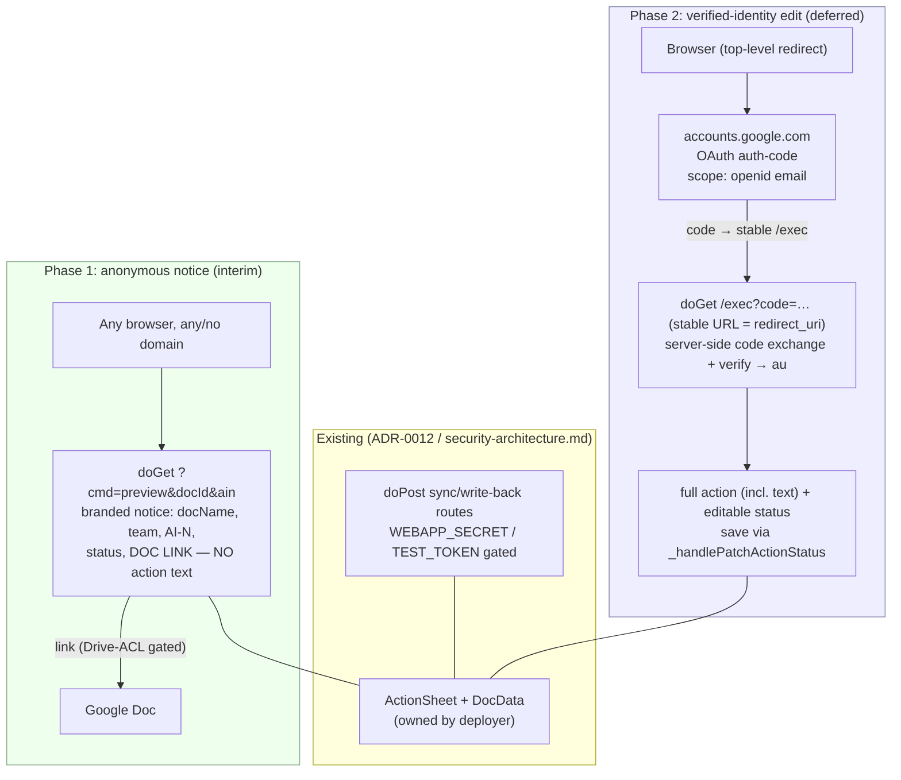
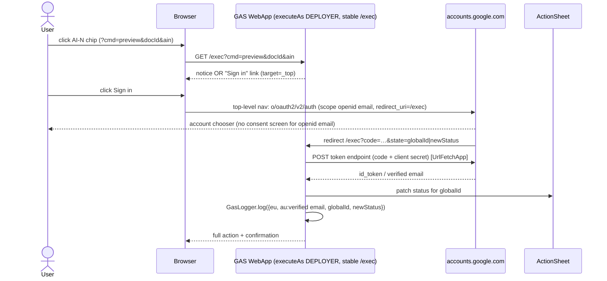

# ADR-0017: Verified identity for chip-link action editing

**Status:** Proposed _(revised 2026-06-14 after validation — supersedes the original GIS-in-iframe draft; see `knowledge-base/adr/probes/0017-validation.md`)_
**Date:** 2026-06-14
**Relates to:** ADR-0012 (web app two-layer auth), `docs/security-architecture.md` §1-3
(execution identity model, trust boundaries, `_getIdentity()`), F3 (globalId-keyed
unauthenticated reads)

## Context

The `AI-N` chip URL embedded in a Doc (`?cmd=preview&docId=<docId>&ain=AI-N`) has no landing
page — `doGet` only self-registers `WEBAPP_URL`. We want a recipient who clicks the chip —
including someone **outside** `northlakeuu.org` — to land on a page about that action and,
ultimately, edit its status.

**Security driver:** action items may contain **confidential information**. The chip URL's only
implicit capability is *knowledge of a `globalId`*, which is forwardable and guessable — the
same F3 exposure class in `docs/security-architecture.md`. Knowledge of a `globalId` is
therefore **insufficient** to expose the action's text or to authorize an edit. Both must be
gated on a **verified identity**.

The webapp runs `executeAs DEPLOYER` on `ANYONE_ANONYMOUS`; `_getIdentity()` (`WebApp.js:25`)
records `eu` (deployer) but `au` (caller) is empty on this surface. There is no existing
mechanism to obtain a verified caller email from an arbitrary browser. Validation
(`probes/0017-validation.md`) established which mechanisms are technically possible — summarised
under Rejected Alternatives.

## Decision

Editing a chip-linked action — and exposing its text — **requires a verified Google identity**,
obtained via the **OAuth 2.0 authorization-code redirect flow anchored on the stable GAS
web-app URL** (not the GIS JavaScript widget, not an external host). Until that flow ships, the
anonymous chip-preview exposes only **non-confidential metadata** and directs the user to open
the source document, whose Drive ACL is the real access gate.

### Phase 1 — interim anonymous notice page (current target)

`doGet ?cmd=preview&docId=<docId>&ain=AI-N` renders a branded notice page that shows **only**:
document name, team name (if resolvable), action id (`AI-N`), current status, and a **link to
the document**. It explicitly does **not** render the action text. It tells the user to open the
document to edit. The doc link resolves only for users who already have Drive access
(ACL-enforced) — so it adds no new exposure.

### Phase 2 — verified-identity editing (target, deferred — see Blocking Dependencies)

`doGet` adds: a "Sign in with Google" link (`target="_top"`) → full-page nav to
`accounts.google.com/o/oauth2/v2/auth` (`scope=openid email`, `redirect_uri=<stable /exec>`,
`state=<globalId|newStatus>`) → Google redirects back to `/exec?code=…&state=…` → `doGet`
exchanges the code server-side (`UrlFetchApp` POST + client secret) and verifies it (the
`tokeninfo`/userinfo pattern, validated live). The verified email becomes `au`; the page then
renders the full action (including text) with an editable status and saves via the existing
`_handlePatchActionStatus` core, logging `{ eu, au, globalId, newStatus }` via `GasLogger`.

**Authentication ≠ authorization.** A verified identity proves only *who* the caller is — it
could be *any* Google account. Before exposing the action text or allowing an edit, Phase 2
**must** confirm the verified identity has access to the referenced document; otherwise any
Google-account holder who knows or guesses the chip `globalId` could read confidential
information. The mechanism (deployer-side Drive permissions check vs. requesting a Drive read
scope from the user) is an open question with a safe default of **deny → fall back to the Phase 1
notice**. Tracked as `GTaskSheet-1hyh`, a blocking dependency of the Phase 2 edit
(`GTaskSheet-6dlp`).

#### Blocking dependencies (Phase 2 — operator GCP-console tasks; code is blocked until done)

1. **OAuth consent screen:** User type **External**, publishing status **In production /
   Published**, scopes `openid email` (`profile` optional). Non-sensitive scopes → **no** Google
   verification/security review. (In *Testing* mode only listed test users can sign in.)
2. **OAuth 2.0 Client ID** (type **Web application**), in the same GCP project as the Apps
   Script project; the deployment's `/exec` URL registered as an **Authorized redirect URI**
   (per deployment — test, then prod).
3. **Client secret** stored in Script Properties (`GIS_CLIENT_ID` / `GIS_CLIENT_SECRET`);
   server-side only, never sent to the browser.

### Architecture

### Sequence (Phase 2)

## Rejected alternatives

| Alternative | Why rejected |
|---|---|
| GIS Sign-In **JS widget** inside the GAS HtmlService page | Blocked: GAS serves content from a rotating `*.googleusercontent.com` iframe origin that **cannot** be a registered Authorized JS origin (Google rejects `googleusercontent.com` — issuetracker 170740549); and no new Google session may be created in a cross-origin iframe. |
| Stable **external host** (GitHub Pages / Firebase) for GIS | Unnecessary: the stable GAS `/exec` URL itself serves as the OAuth `redirect_uri`, keeping the entire flow in the existing deployment (proven by the `apps-script-oauth2` pattern). |
| **Anonymous edit** (no identity, capability = knowledge of `globalId`) | Rejected for confidential content: a `globalId` is forwardable/guessable (F3-class) — insufficient to expose action text or authorize edits. |

## Security concern

Action text may be confidential. The anonymous Phase-1 preview therefore discloses only
non-confidential metadata (document name, team name, `AI-N`, status) plus a document link whose
access is enforced by Drive ACL. Full content and editing are deferred to Phase 2 behind a
verified identity, and every status change records the verified `au` in the audit log.

**Two distinct gates in Phase 2 — both required:**
1. **Authentication** — OAuth verifies *who* the caller is (`GTaskSheet-6dlp`).
2. **Authorization** — the verified identity must hold Drive access to the referenced document
   before any confidential content or edit is exposed (`GTaskSheet-1hyh`). Verified-but-
   unauthorized access (any Google account, no file access) must be denied — falling back to the
   Phase 1 notice — or it becomes a confidential-data leak to any Google user holding a
   `globalId`. Default-deny when access cannot be positively confirmed.

## Consequences

- **Phase 1** gives external recipients a useful, safe landing page now — zero GCP setup, no
  confidential disclosure, ACL-gated doc link.
- **Phase 2** satisfies the verified-who requirement with **no external infrastructure** (one
  OAuth client on the existing deployment).
- **Constrains:** the new routes must not reuse `WEBAPP_SECRET`-gated handlers directly;
  `_getIdentity()`'s `au` gains a second source (OAuth-verified) distinct from
  `Session.getActiveUser()`. The prod deployment later needs its own `/exec` added to the OAuth
  client's redirect-URI list.
- **Open seam (deferred → ROADMAP §Funnel):** email-code verification for recipients **without**
  a Google account (verifies any email via `MailApp`, entirely in GAS, no GIS) — a future
  enhancement, not built now.

## Tracking

| Phase | Epic | Children |
|---|---|---|
| Phase 1 (interim) | `GTaskSheet-krz5` — Anonymous chip-preview notice | `mus0` [IMP], `zb3l` [TST] |
| Phase 2 (deferred) | `GTaskSheet-79dw` — Authorized web app AI editing | `hc6v` [INF], `1hyh` [IMP authz], `6dlp` [IMP edit] (blocked by hc6v + 1hyh) |
