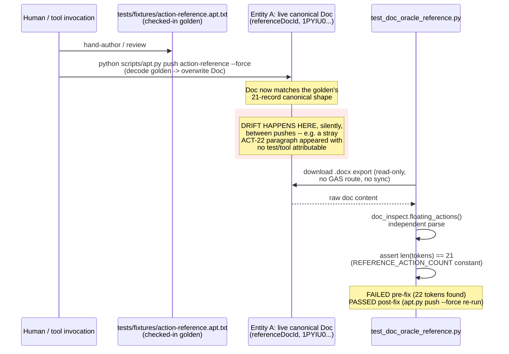
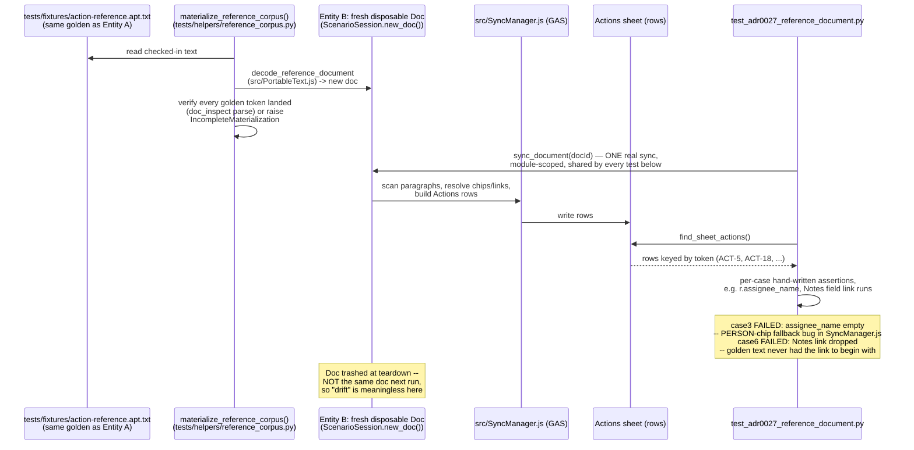
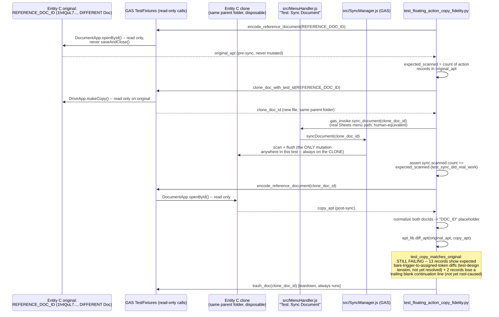

# gts-py21: reference-doc copy-fidelity — RESOLVED

**Status:** `gts-py21` is CLOSED (`regression=pending`). Entity C's
`test_copy_matches_original` is green against TEST v0.2.3.69. See
"Resolution (2026-08-31)" at the bottom for what actually fixed it; the body below is the
investigation record that got there, kept because its three-entity model is the durable part.

## Origin

`gts-u947`'s full-sweep regression-verify (`knowledge-base/staging/docdata-litter-apt-speed.md`)
surfaced 4 failures, reproduced identically across two independent runs on 2026-08-31 (not a
flake), that the original triage lumped together as "the shared canonical reference doc" — filed
under that framing as `gts-py21`. **That framing was imprecise and is corrected below (see
"Reference-doc lifecycle" section): there are actually THREE distinct reference-doc entities in
this codebase, and only one of the 4 original failures was actually about live-doc drift.** The
other three were pipeline/fixture bugs unrelated to any doc mutating out from under a test. This
correction matters for whoever picks up the residual `test_copy_matches_original` failure — it is
the ONE test in this bead touching the third entity (`REFERENCE_DOC_ID` in
`test_floating_action_copy_fidelity.py`), a doc the other three fixes never touched.

## What's already fixed (this bead, this session)

A subagent investigated all 4 original failures. Neither of the two named suspects
(`gts-1ej4` — `DocReader` onto `doc_inspect.floating_actions()`; `gts-3koi` — status-icon
insertion in `decodeAptIntoDoc`) was the actual cause of any of them. Instead, 4 distinct real
issues were found and fixed:

1. **Genuine doc drift, on Entity A (see below)** — a duplicate "ACT-22" paragraph had been
   inserted into the live canonical `referenceDocId` doc (`1PYIU022o5dWNhIkyErjUzF6TRg--
   r4QrH-h-JbPNO-E`, from `local.settings.json`) outside any test path. Restored via
   `python scripts/apt.py push action-reference --force` (overwrites the live Doc from the
   checked-in golden). Fixes `tests/test_doc_oracle_reference.py::
   test_reference_doc_holds_21_floating_actions` (now 21 tokens, passes). This is the only one of
   the 4 original failures that was actually about a live Google Doc's content drifting.
2. **Real bug, on Entity B's decode/sync pipeline (see below), `src/SyncManager.js` (~line 1035,
   `_personChipAtParaOffset`)** — PERSON-chip name resolution had no fallback when Google can't
   resolve a display name for a non-directory test email (`insertPerson` only accepts `{email}`,
   never a name). Added the same `_nameFromEmail()` fallback the sibling text-assignee path
   already used. Deployed TEST v0.2.3.66. Fixes `tests/test_adr0027_reference_document.py::
   TestGrammarMatrix::test_case3_person_chip_identity_wins`. **Not doc drift** — this test never
   touches the live canonical Doc; it decodes the checked-in golden into a fresh disposable doc
   every run (see Entity B).
3. **Fixture-authoring gap, on Entity B's golden text, `tests/fixtures/action-reference.apt.txt`**
   — the golden fixture's ACT-18 "Notes" field never actually contained the hyperlink its own test
   expects. Added the missing markdown link and restored the label-only-bold convention. Fixes
   `tests/test_adr0027_reference_document.py::TestFieldContinuation::
   test_case6_field_value_hyperlink_survives`. **Not doc drift either** — same disposable-doc path
   as #2; the bug was in the checked-in text file itself, never in a live Doc.
4. **Real bug, `src/SyncManager.js`** (`_renderCustomFieldLines`/`_buildFlushRequests`) — custom
   field **values** (as opposed to labels) never had their bold/italic/link runs reapplied on
   flush, silently dropping formatting/hyperlinks on every real re-sync. Fixed by extending
   `_renderCustomFieldLines` to emit `valueRuns` and applying them. Deployed TEST v0.2.3.67,
   verified directly against a live doc. Also fixed a related bug in `scripts/apt_lib.py`:
   `_field_labels` misclassified a bare `ACT:`/`AI:` trigger line as a custom field named "ACT",
   producing false structural-diff noise once the trigger becomes an assigned token.

Files touched so far for this bead: `src/SyncManager.js`, `scripts/apt_lib.py`,
`tests/fixtures/action-reference.apt.txt`. TEST is deployed at v0.2.3.67. Nothing committed —
working tree left as-is.

## Reference-doc lifecycle: three distinct entities, not one

The original triage (and this bead's own title) treated "the reference doc" as a single thing.
It isn't. There are **three separate Google Docs / doc-shaped things** in play, each with its own
lifecycle, its own mutation rules, and its own oracle (what it gets compared against). Confusing
them is exactly how the original triage over-generalized 4 unrelated failures into one bead.

| | **Entity A — live canonical Doc** | **Entity B — disposable materialized Doc** | **Entity C — copy-fidelity pair** |
|---|---|---|---|
| **Identity** | `settings['referenceDocId']` (`local.settings.json`) = `1PYIU022o5dWNhIkyErjUzF6TRg--r4QrH-h-JbPNO-E` | a fresh doc from `ScenarioSession.new_doc()`, one per test session, trashed after | `REFERENCE_DOC_ID` hardcoded in `test_floating_action_copy_fidelity.py` = `1h4QuL7mZVybEj6T4QHAAqk8LMoyNGj0fT9XVTHVs9_E` (**a different real Doc from Entity A**), plus a disposable clone of it |
| **Persistence** | Permanent, hand-maintained, shared across all sessions/time | Ephemeral — created and trashed within one pytest session | The original is permanent/shared like Entity A; the clone is ephemeral like Entity B |
| **Source of truth** | The checked-in golden `tests/fixtures/action-reference.apt.txt`, pushed onto the Doc by a human/tool | The same checked-in golden, decoded fresh every run | The Doc's own live content — no checked-in golden governs it (a golden exists as a stub, `floating-action-copy-fidelity.apt.txt`, but no one has blessed it yet) |
| **Who mutates it, how** | `scripts/apt.py push action-reference [--force]` (human-invoked, overwrites the Doc from the golden text) | `materialize_reference_corpus()` decodes the golden into it once, then `test_adr0027_reference_document.py`'s `reference` fixture syncs it once | **Never mutated directly** — only a same-folder *clone* is synced; the original is read-only (`encode_reference_document`'s `DocumentApp.openById()` never calls `saveAndClose()`) |
| **Read by which test(s)** | `tests/test_doc_oracle_reference.py` (direct `.docx` export + `doc_inspect.floating_actions()` parse — no GAS route, no sync) | `tests/test_adr0027_reference_document.py` (reads the SHEET via `find_sheet_actions()`, after a real sync of the materialized doc) | `tests/test_floating_action_copy_fidelity.py` (reads both the original's and the clone's APT via `encode_reference_document`) |
| **Compared against** | A hardcoded count constant (`REFERENCE_ACTION_COUNT = 21`) and per-token structural checks (linked, non-pending, etc.) — not a text diff against the golden | Hand-written expected field values in each test method (`assert r.assignee == "jane@example.com"`, etc.) — i.e. the SYNC RESULT is checked against per-case expectations, not against the golden text itself | The clone's **post-sync** APT is diffed (`apt_lib.diff_apt`) against the original's **pre-sync, read-only** APT — a Doc-vs-Doc structural diff, doc ids normalized to a shared placeholder first |
| **What broke in this bead** | Drifted: an extra "ACT-22" paragraph had been added outside any test path. **Fixed** (`apt.py push --force`). | Two independent pipeline bugs (PERSON-chip name fallback; missing hyperlink in the golden text). **Both fixed.** | **Still broken** — see residual gap below. Never touched by any of the other 3 fixes. |

**Key takeaway for whoever picks this up:** Entity A's drift is fixed and is a closed loop —
`apt.py push --force` is the known repair, and nothing in this investigation found what *caused*
the drift (worth asking, but out of scope for a doc-content restore). Entity B's two bugs are
fixed and were never about doc drift at all — don't go looking at the live Doc for those. **Only
Entity C remains broken**, and it is a genuinely different Doc (`1h4QuL7...`, not `1PYIU0...`)
that none of the other 3 fixes touched or could have touched — the residual failure needs its own
investigation into `apt_lib.diff_apt`'s normalization rules and `src/PortableText.js`'s
encode/decode path, not another look at Entity A or B.

## The residual gap, as first diagnosed — both halves now RESOLVED, see "Resolution" below

`tests/test_floating_action_copy_fidelity.py::TestFloatingActionCopyFidelity::test_copy_matches_original`
still failed at this point (this test file is itself new — never run clean before this sweep).
Two distinct, separately-diagnosed residual causes:

**(a) Bare-trigger → assigned-token structural diffs (13 records).** When a bare `AI:`/`ACT:`
trigger in the original doc gets synced and assigned a real token in the copy, `apt_lib`'s diff
correctly reports that as a structural change — and `apt_lib`'s own design note says the differ is
*not* meant to hide this class of diff. This is a **test-design tension**, not yet resolved:
either `test_copy_matches_original`'s oracle needs to normalize bare-trigger-vs-assigned-token
pairs before diffing (so a legitimate bare→assigned transition doesn't read as "record content
changed"), or the reference doc/test needs to avoid bare triggers entirely so every record is
already assigned before the copy-fidelity check runs. No fix attempted — needs a human or a fresh
investigation to pick a direction.

**(b) Trailing blank continuation line lost (2 list-item records).** A narrower gap: 2 list-item
records lose a trailing blank continuation line in a field value on the copy round-trip. Not yet
root-caused — no hypothesis recorded beyond "distinct from (a)."

## Resolution (2026-08-31)

`test_copy_matches_original` is green (TEST v0.2.3.69). The residual gap turned out to be
**one oracle question and two real GAS bugs**, not one thing.

### Direction taken on gap (a) — decided by the project owner

**Normalize in the oracle.** The reference doc's seed content stays as authored (a deliberate
mix of bare `ACT:` triggers and pre-assigned demonstration paragraphs — that mix is what the doc
is *for*). `apt_lib`'s differ now recognises the one write in a record's life where the bare→
assigned transition happens and treats *only that write's own canonicalisations* as non-diffs.

`scripts/apt_lib.py`:
- `_normalize_n` now normalises the token on **every line** of a record, not just its first.
  `src/SyncManager.js`'s `_collectTokenParagraphs` scans every line of a paragraph, so a record
  shaped `<LI> intro text:<SR>\nACT: ...` is as much an action record as a token-leading one —
  and its N is equally positional. Anchoring at line 0 left those records' N un-normalised, which
  alone accounted for 4 of the final failures.
- `_bare_to_assigned_lines(golden, capture)` returns the line indices where the golden still
  carries a bare trigger and the capture carries an assigned token.
- `_undo_first_flush_canonicalisation` reduces the capture, on exactly those lines, back to the
  pre-flush spelling: the bold preview-linked `[**ACT-#: **](url)` header back to a bare
  `ACT-#: `; the ` (Open)` suffix that ADR-0027 rule 4 bundles with assignment away — **but only
  when the golden did not already carry a status of its own** (a hand-authored status is an input
  to the flush, so an Open→Done change across the transition still diffs); and each continuation
  field's canonical `**Label:**\t` (`_renderCustomFieldLines`) back to the hand-typed `Label: `.

Everything else in the record — prose, chips, links, line count — is untouched and diffs
normally. Proven by negative tests, not just by the suite going green
(`tests/test_apt_differ.py::TestBareTriggerFirstFlush`): a PERSON chip dropped, a trailing blank
line dropped, prose edited, or a status changed *on the same flush* all still fail.

### Real bug 1 — PERSON chip silently dropped on the soft-return scan path

`src/SyncManager.js`'s `_parseSoftReturnParagraphActions` located the assignee chip by a single
character offset: the one past the token's whole trailing-`\s*` run. A PERSON contributes zero
characters to `getText()`, so `ACT-N: ` + chip + ` text` reads back as `ACT-N:  text` — two
spaces, chip at the boundary *between* them. Consuming the whole whitespace run therefore landed
one character **past** the chip's boundary and `_personChipAtParaOffset` found nothing. Every
record whose token follows an intro line in the same paragraph lost its assignee on sync; the
fast path (`_parseParagraphAsFloatingAction`), which walks child elements instead of offsets,
was unaffected — which is why this stayed invisible until a doc mixed both shapes.

Fix: probe every boundary in the token's trailing-whitespace span, first hit wins. Bounded by
the token's own whitespace, so it can never reach a chip belonging elsewhere in the line; also
covers the no-space-at-all spelling (`ACT-N:` + chip).

### Real bug 2 — trailing blank continuation line eaten on the soft-return path

Round 1 removed an unconditional `.replace(/\n$/, '')` at three scanner sites, which fixed the
plain-paragraph case but not the list-item + intro-line case. The remaining culprit was
`_trimTracked` inside `_parseSoftReturnParagraphActions`'s `flush()`: its trailing pass tests
`/\s/`, which swallows a genuine trailing `\n` (a soft return typed as the paragraph's very last
character) along with stray spaces. The single-token fast path does not trim there at all, so
the two parsers disagreed on what a trailing blank line meant.

Fix: `_trimTrackedKeepingLineBreaks` — identical to `_trimTracked` except the trailing pass is
narrowed to `[ \t]`. Used only at that one call site; `_trimTracked`'s two other callers
(header/status parsing) are unchanged.

### Spun out, not fixed here

`gts-lu5k` — `tests/helpers/doc_inspect.py`'s `_parse_paragraph` has the *same* "token must be at
paragraph start" assumption on the Python side: a freshly-synced clone reported 16 actions from
the GAS scanner but only 12 from `doc_inspect.floating_actions()`, with the four intro-line
records silently absent rather than flagged. Latent today — `tests/fixtures/action-reference.apt.txt`
(Entity A's golden, which `REFERENCE_ACTION_COUNT = 21` is measured against) contains **zero**
records of this shape, verified — so it has never been visible there. It becomes a silent
false-negative the moment anyone adds one.

### Gate

Targeted, not the full sweep (per this project's CLAUDE.md backstop rules — `regression=pending`):
`test_floating_action_copy_fidelity.py` (2 passed, 1 skipped), plus
`test_floating_action_scanner.py`, `test_adr0027_reference_document.py`,
`test_apt_scanner_lane.py`, `test_status_token_parens.py` (34 passed),
`test_apt_flush_lane.py`, `test_apt_corpus_check.py`, `test_apt_format_lane.py`, and the offline
differ/CLI/lint lanes (261 passed). `gts-u947`'s authorised full sweep is what flips this to
`regression=verified`.
